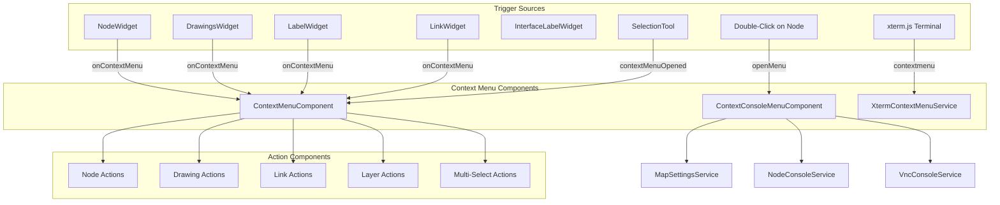
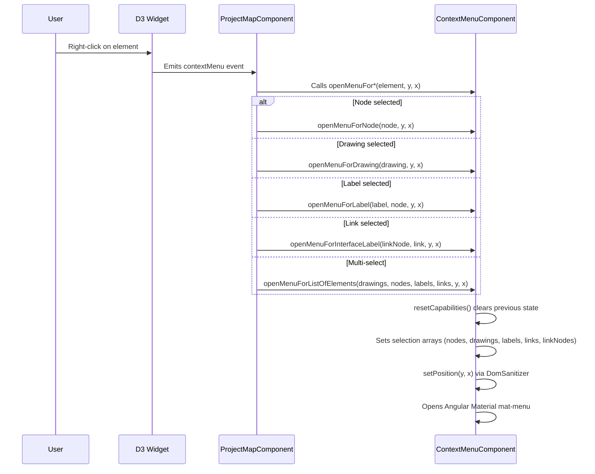
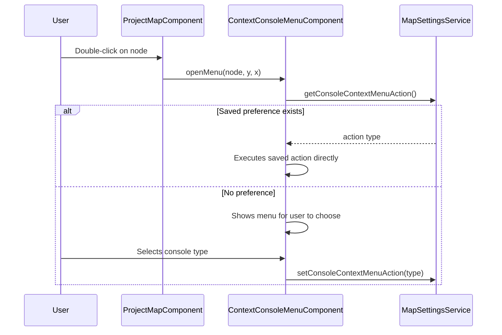

<!--
SPDX-License-Identifier: CC-BY-SA-4.0
See LICENSE file for licensing information.
-->

  > AI-assisted documentation. [See disclaimer](../README.md). 

# Context Menu System

> Right-click context menus for topology elements and terminal widgets

**Version**: v2.0
**Updated**: 2026-04-19
**Status**: Implemented

---

## Architecture Overview

### Component Responsibilities

| Component | Responsibility |
|-----------|---------------|
| `ContextMenuComponent` | Main topology context menu; manages positioning, selection state, and action visibility |
| `ContextConsoleMenuComponent` | Console selection menu on node double-click; persists user's default console preference |
| `XtermContextMenuService` | Terminal widget context menu providing copy, paste, select all, and clear selection |

---

## Flow Description

### Context Menu Open Flow

### Console Menu Flow

---

## Implementation Logic

### Selection State Management

`ContextMenuComponent` maintains five parallel selection arrays that determine which menu items appear. When a context menu opens, all arrays are cleared via `resetCapabilities()`, then only the relevant arrays are populated based on the element type:

- **Node context**: populates `nodes[]` (single or multiple)
- **Drawing context**: populates `drawings[]`, detects `hasTextCapabilities` for TextElement instances
- **Label context**: populates `labels[]` and `nodes[]` (label's parent node)
- **Interface label context**: populates `linkNodes[]` and `links[]`
- **Multi-select**: populates all applicable arrays from the current selection

### Action Visibility Rules

Each action component is conditionally rendered based on the selection state. The key rules are:

**Node actions** — require nodes in selection:
- Single-node actions (show, config, console, isolate/unisolate, hostname, symbol) require `nodes.length === 1`
- Multi-node actions (start, stop, suspend, reload) require `nodes.length >= 1`
- Type-specific actions (edit config, idle PC) additionally check `node_type`
- HTTP console and browser console require a non-read-only project
- Console device browser requires both non-read-only and single node

**Drawing actions** — require drawings or specific drawing capabilities:
- Edit style requires single drawing without text capabilities
- Edit text activates when a single text-capable drawing, label, or linkNode is the sole selection

**Link actions** — require exactly one link with no drawings or nodes selected, and no linkNodes. All link actions additionally require a non-read-only project. There are 10 link actions: start/stop capture, capture on started link, web Wireshark (new tab and inline), packet filters, resume, suspend, reset, and edit style.

**Layer actions** — require drawings or nodes in a non-read-only project. All three layer operations (move up, move down, bring to front) share the same visibility condition.

**Multi-select actions** — alignment requires `nodes.length > 1` in a non-read-only project. Duplicate requires drawings or nodes. Lock requires drawings or nodes. Delete requires drawings, nodes, or links (but not linkNodes).

### Z-Value Layer System

Layer management uses a numeric z-value system where higher values appear on top. Three operations are available:

- **Move layer up**: increments z-value by 1
- **Move layer down**: decrements z-value by 1
- **Bring to front**: sets z-value to `max(all z-values) + 1`

There is no "send to back" operation. Layer changes persist to nodes and drawings data sources, then are saved via API calls.

### Action Components

There are 38 active action components organized under `context-menu/actions/`. Each is a standalone Angular component with `ChangeDetectionStrategy.OnPush`. Two additional directories (`console-device-action`, `open-file-explorer`) exist but are not imported or used by the context menu.

### Console Preference Persistence

`ContextConsoleMenuComponent` stores the user's default console action via `MapSettingsService`. Once set, double-clicking a node bypasses the menu and directly executes the saved action. Supported actions are: open console (embedded telnet), open web console, and open web console in new tab. Console routing varies by node `console_type`: telnet opens inline, VNC opens a standalone page, and SPICE is not yet supported.

### Terminal Context Menu

`XtermContextMenuService` provides a DOM-based context menu for xterm.js terminal widgets. It offers copy, paste, select all, and clear selection operations. The service attaches to the terminal element's `contextmenu` event and returns a cleanup function for proper event listener removal.

---

**Last Updated**: 2026-04-19
**Document Version**: 2.0

---

## License

This documentation is licensed under the [Creative Commons Attribution-ShareAlike 4.0 International License (CC BY-SA 4.0)](https://creativecommons.org/licenses/by-sa/4.0/).
