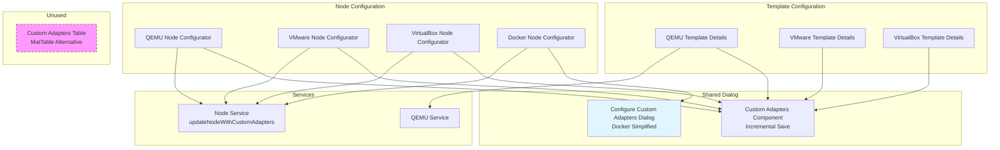
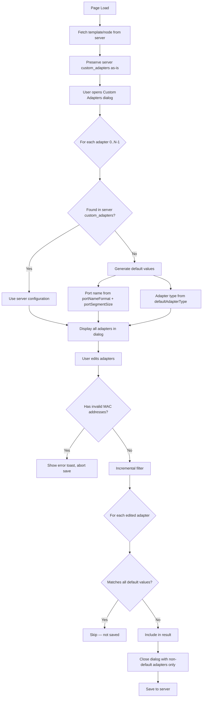

<!--
SPDX-License-Identifier: CC-BY-SA-4.0
See LICENSE file for licensing information.
-->
# Custom Adapters Implementation

**Last Updated**: 2026-04-18

## Architecture Overview

### Component Responsibilities

| Component | Path | Responsibility |
|-----------|------|----------------|
| **Custom Adapters Component** | `src/app/components/preferences/common/custom-adapters/` | Shared dialog for QEMU/VMware/VirtualBox adapters. Implements incremental save — only non-default adapters are persisted. Validates MAC addresses before save. |
| **Configure Custom Adapters Dialog** | `src/app/components/project-map/node-editors/configurator/docker/configure-custom-adapters/` | Simplified Docker-only dialog. Only supports port name editing (no adapter type or MAC). Saves all adapters (no incremental logic). |
| **Custom Adapters Table** | `src/app/components/preferences/common/custom-adapters-table/` | MatTable-based inline editor alternative. Currently **unused** — registered in `app.module.ts` but not referenced in any template. |
| **Template Details** (QEMU/VMware/VirtualBox) | `src/app/components/preferences/{qemu,vmware,virtual-box}/*/` | Load template data, open the shared dialog, save only custom adapters back to server via template service. |
| **Node Configurators** (QEMU/VMware/VirtualBox) | `src/app/components/project-map/node-editors/configurator/{qemu,vmware,virtualbox}/` | Load node data, open the shared dialog, save via `NodeService.updateNodeWithCustomAdapters()`. |

## Data Flow

## Implementation Logic

### Incremental Save Strategy

The core principle is **only persist adapters that differ from default values**. This matches the Desktop GUI behavior and avoids storing redundant configuration on the server.

**Default value calculation:**

| Field | Default | Source |
|-------|---------|--------|
| `port_name` | Generated from `portNameFormat` and `portSegmentSize` | Template/node configuration |
| `adapter_type` | From `defaultAdapterType` parameter | Template form's `networkType` (templates) or `node.properties.adapter_type` (nodes), falls back to `networkTypes[0]?.value` then `'e1000'` |
| `mac_address` | Empty (null) | — |

**Port name generation** uses segment-based logic when `portSegmentSize > 0`: the adapter number is decomposed into segment and port-within-segment to compute the display name. When `portSegmentSize` is 0, simple `{0}` replacement is used.

### Template vs Node Configuration

Both contexts use the same `CustomAdaptersComponent` dialog with identical incremental save logic. The differences are in data source and save method:

| Aspect | Template Configuration | Node Configuration |
|--------|----------------------|-------------------|
| Adapter count source | `template.adapters` | `node.properties.adapters` |
| Default adapter type source | Form's `networkType` field | `node.properties.adapter_type` |
| Port name format source | Template form fields | `node.port_name_format` |
| Save method | Template service PUT | `NodeService.updateNodeWithCustomAdapters()` |
| Save scope | Affects new nodes from template | Affects running node immediately |

`NodeService.updateNodeWithCustomAdapters()` additionally filters null `port_name` and `mac_address` fields from the payload before sending the PUT request, ensuring clean server data.

### Docker Node Model

Docker nodes use `ConfigureCustomAdaptersDialogComponent` instead of the shared dialog. Docker adapters are simpler — they only support `adapter_number` and `port_name` (no `adapter_type` or `mac_address`). Docker adapters are saved in full (all entries), not incrementally.

### MAC Address Validation

The dialog enforces MAC validation at three levels:

1. **Auto-formatting** on input — strips non-hex characters, formats as `XX:XX:XX:XX:XX:XX` at 12 digits
2. **Per-field inline validation** via regex — displays `mat-error` with specific messages (too short, too long, invalid format)
3. **Pre-save gate** — `configureCustomAdapters()` blocks save and shows an error toast if any adapter has an invalid MAC

Empty MAC values are valid (the field is optional).

## Related Documentation

- [Desktop GUI Custom Adapters](https://github.com/GNS3/gns3-gui/blob/master/gns3/dialogs/custom_adapters_configuration_dialog.py)

---

## License

This documentation is licensed under the [Creative Commons Attribution-ShareAlike 4.0 International License (CC BY-SA 4.0)](https://creativecommons.org/licenses/by-sa/4.0/).
