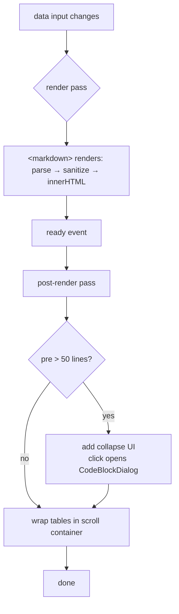

# Markdown Viewer

Unified markdown rendering, shared by every markdown surface in the
application.

## Architecture Overview


**Component responsibilities:**

| Piece | Responsibility |
|---|---|
| `MarkdownViewerComponent` | Only public API is the `data` input; owns the post-render pass |
| ngx-markdown root config | Parses markdown and sanitizes the rendered HTML |
| `_markdown.scss` | All descendant typography (runtime HTML carries no encapsulation attribute, so global scoping is required); every personalizable declaration reads a `--markdown-viewer-*` token |
| Call-site SCSS | Personalizes the viewer by overriding tokens and inheritable properties on the host element — no global edits |

**Personalization tokens:** `--markdown-viewer-font-size` (scales everything, descendants are em-based), `-line-height`, `-text-color`, `-link-color`, `-heading-weight`, `-heading-scale` (multiplies all h1–h6 sizes together), `-code-bg`, `-pre-bg`, `-pre-border`.

## Flow Description



Key sequencing properties:

- **`(ready)` replaces the MutationObserver** — ngx-markdown replaces the inner HTML on every render, so re-running the idempotent post-render pass per render covers all updates (data change) without observer lifecycle.
- **Fenced languages render as plain code blocks** — diagram fences such as ```` ```mermaid ```` are not executed anywhere; they degrade to syntax-highlighted code like any other language.

## Implementation Logic

- The viewer lives in `src/app/common/markdown-viewer/` next to
  `code-block-dialog/` (relocated from the AI chat folder so shared widgets do
  not depend on feature folders). Five call sites render through it: the chat
  message list, the node info dialog usage tab, the README editor preview, the
  projects detail description, and the project README dialog.
- Styling constraint: ngx-markdown creates inner HTML at runtime without
  encapsulation attributes, so component SCSS cannot target descendants and
  `ViewEncapsulation.None` is banned by project rules. The global block in
  `src/styles/_markdown.scss` scoped to the `app-markdown-viewer` element
  selector is the established pattern; CSS custom properties inherit through
  the DOM, which is what makes the token API work across that boundary.
- The legacy project README dialog previously parsed with `marked()` and bound
  the result through `bypassSecurityTrustHtml` — an XSS-risk outlier. It now
  renders through the viewer like every other surface, going through Angular's
  HTML sanitizer, and uses the standard dialog structure (`mat-dialog-title` /
  `mat-dialog-content` / `mat-dialog-actions`) sized by the SDS
  (`dialog-large-panel` + `dialog-height-80-panel`) for reading comfort.
