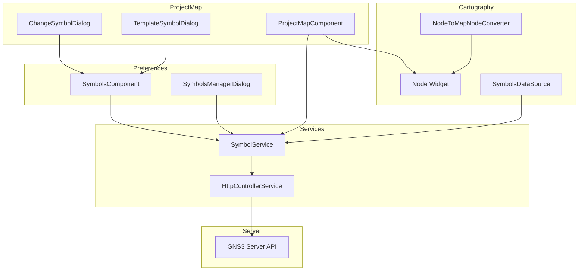
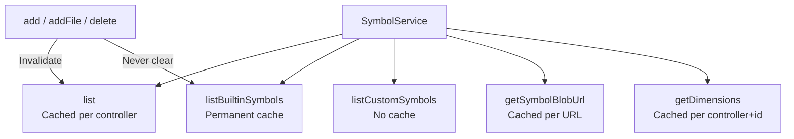
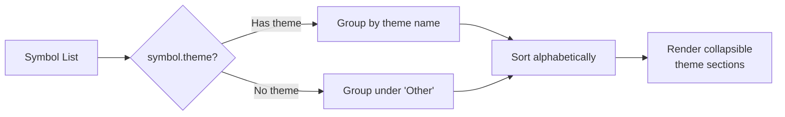

<!--
SPDX-License-Identifier: CC-BY-SA-4.0
See LICENSE file for licensing information.
-->
# GNS3 Symbols

## Architecture Overview



### Component Responsibilities

| Component | Responsibility |
|-----------|---------------|
| **SymbolsComponent** | Browsing, filtering, theme grouping, selection, delete mode |
| **SymbolsManagerDialog** | Upload (text/binary) and bulk deletion of custom symbols |
| **ChangeSymbolDialog** | Node symbol selection via embedded SymbolsComponent |
| **TemplateSymbolDialog** | Template symbol selection via embedded SymbolsComponent |
| **SymbolService** | Symbol CRUD, caching, blob URL management, dimension scaling |
| **HttpControllerService** | HTTP abstraction with `getBlob()` / `postBlob()` for binary data |
| **Node Widget** | Renders SVG `<image>` elements on canvas |
| **NodeToMapNodeConverter** | Converts `Node.symbol_url` to `MapNode.symbolUrl` for D3 rendering |

---

## Flow Description

### Symbol Upload Flow

```mermaid
flowchart LR
    A[File Selected] --> B{Extension?}
    B -->|SVG / SVGZ| C[Read as Text]
    B -->|PNG / JPG / GIF| D[Create Blob]
    B -->|Other| E[Create Blob<br/>octet-stream]
    C --> F[POST as text<br/>/symbols/{name}/raw]
    D --> G[POST as binary<br/>/symbols/{name}/raw]
    E --> G
    F --> H[Invalidate list cache]
    G --> H
    H --> I[Refresh symbol list]
```

SVG/SVGZ files are uploaded as text content. All other formats (PNG, JPG, GIF, and unknown extensions) are uploaded as binary blobs to avoid Base64 overhead and preserve correct MIME types.

### Symbol Rendering Flow

```mermaid
flowchart TD
    A[Nodes loaded from server API] --> B{Symbol changed<br/>since last render?}
    B -->|Yes| C[Clear node.symbol_url]
    B -->|No| D{Dimensions known?<br/>width=0 AND height=0}
    C --> D
    D -->|Unknown| E[GET /symbols/{id}/dimensions]
    D -->|Known| F{symbol_url exists?}
    E --> F
    F -->|No| G[GET /symbols/{id}/raw → Blob]
    G --> H{Blob fetch<br/>succeeded?}
    H -->|Yes| I[URL.createObjectURL → blob URL]
    H -->|No| J[Fallback: direct server URL]
    I --> K[Set node.symbol_url]
    J --> K
    K --> L[SVG image<br/>href=symbol_url]
```

### Caching Flow



### Theme Grouping Flow



---

## Implementation Logic

### Supported Formats

| Format | Extension | Upload Method | Animation |
|--------|-----------|---------------|-----------|
| SVG | `.svg`, `.svgz` | Text (readAsText) | SMIL |
| PNG | `.png` | Binary (Blob) | No |
| JPG | `.jpg`, `.jpeg` | Binary (Blob) | No |
| GIF | `.gif` | Binary (Blob) | Yes |
| Other | any | Binary (octet-stream) | No |

### Caching Strategy

The `SymbolService` maintains five distinct caches:

- **list()** — Full symbol list, cached per controller (`host:port`), invalidated on any add/delete operation
- **listBuiltinSymbols()** — Built-in symbols only, permanently cached per controller (built-in symbols are immutable)
- **listCustomSymbols()** — Custom symbols only, never cached (always fresh from server)
- **getSymbolBlobUrl()** — Blob URLs for symbol images, cached per raw URL with `shareReplay(1)` to avoid re-fetching
- **getDimensions()** — Symbol dimensions, cached per `controller+symbol_id` with `shareReplay(1)`

Only the regular `list()` cache is cleared when symbols are added or deleted. The builtin cache is never cleared because built-in symbols never change.

### Symbol Rendering

Node symbols are rendered as SVG `<image>` elements on the D3 canvas. The `Node Widget` handles href updates with change detection — when a symbol URL changes, the old href is removed, a reflow is forced, and the new href is set to ensure the browser reloads the image.

Default render dimensions are 60x60 pixels when node width/height are unavailable. The `maximumSymbolSize` constant is 80 pixels; when symbol scaling is enabled, `scaleDimensionsForNode()` scales nodes proportionally so the larger dimension fits within 80px.

### Symbol URL Resolution

Node symbol IDs follow the format `:/symbols/my-symbol.png` for built-in symbols (the `:/symbols/` prefix is the built-in marker). The API path is `/symbols/{symbol_id}/raw`, with symbol IDs URI-encoded via `encodeURI()`. The version prefix (`/v3`) comes from `environment.current_version`, not hardcoded.

### Symbol Change Detection

The `ProjectMapComponent` maintains a `nodeSymbolCache` Map keyed by `node_id`. On each node update, it compares the current `node.symbol` against the cached value. If the symbol changed, `node.symbol_url` is cleared to `null`, forcing a fresh blob URL fetch on the next render cycle.

### API Endpoints

| Operation | Endpoint | Type |
|-----------|----------|------|
| List symbols | `GET /v3/symbols` | JSON |
| Upload symbol | `POST /v3/symbols/{name}/raw` | Binary/Text |
| Get symbol raw | `GET /v3/symbols/{name}/raw` | Binary |
| Get dimensions | `GET /v3/symbols/{name}/dimensions` | JSON |
| Delete symbol | `DELETE /v3/symbols/{name}` | - |

### Key Files

| File | Purpose |
|------|---------|
| `src/app/services/symbol.service.ts` | Symbol CRUD, caching, blob URL management |
| `src/app/services/http-controller.service.ts` | Binary upload/fetch via `postBlob()` / `getBlob()` |
| `src/app/models/symbol.ts` | Symbol model (`builtin`, `filename`, `symbol_id`, `raw`, `theme`) |
| `src/app/components/preferences/common/symbols/symbols.component.ts` | Browsing, selection, delete mode, theme grouping |
| `src/app/components/preferences/common/symbols/symbols-manager-dialog/` | Upload and manage custom symbols |
| `src/app/components/project-map/change-symbol-dialog/` | Change symbol for existing nodes |
| `src/app/components/project-map/template-symbol-dialog/` | Change symbol for templates |
| `src/app/components/project-map/project-map.component.ts` | Symbol URL loading, fallback, change detection, dimensions |
| `src/app/cartography/widgets/node.ts` | SVG `<image>` rendering on canvas |
| `src/app/cartography/converters/map/node-to-map-node-converter.ts` | `Node.symbol_url` to `MapNode.symbolUrl` conversion |
| `src/app/cartography/datasources/symbols-datasource.ts` | Symbol data source for cartography |

---

**Last Updated:** 2026-04-18

---

## License

This documentation is licensed under the [Creative Commons Attribution-ShareAlike 4.0 International License (CC BY-SA 4.0)](https://creativecommons.org/licenses/by-sa/4.0/).
