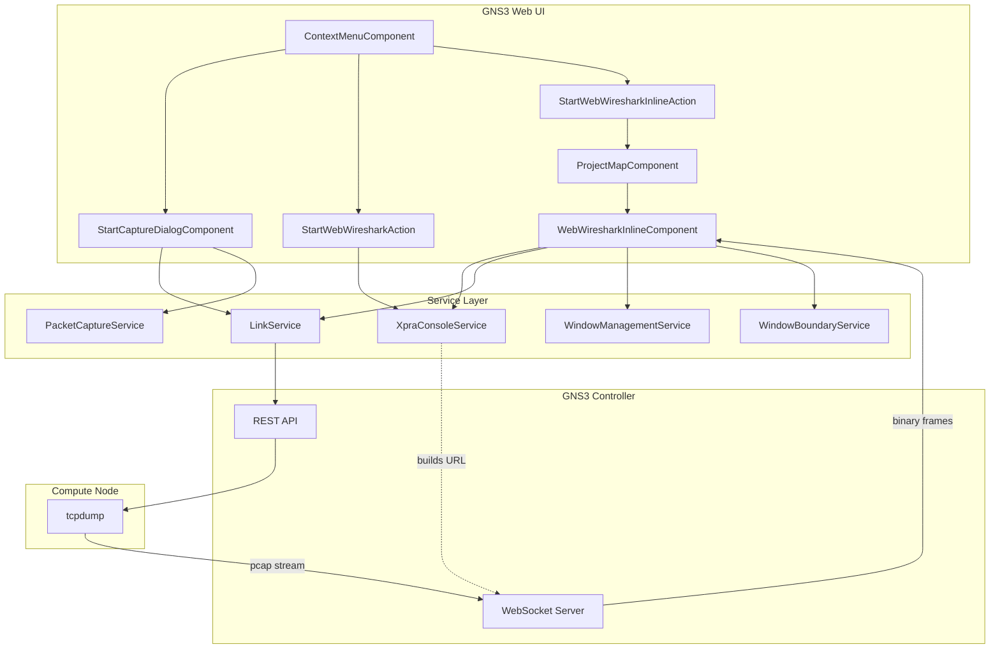
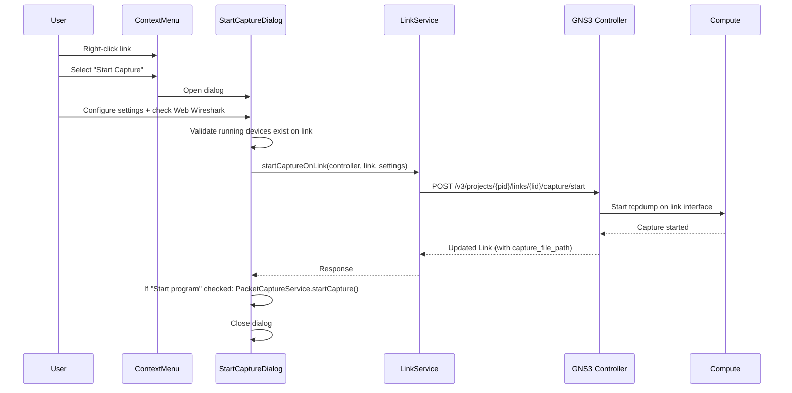
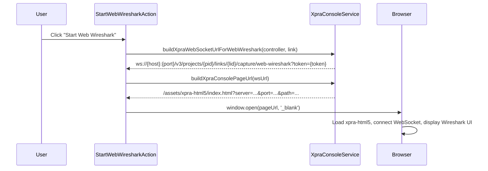
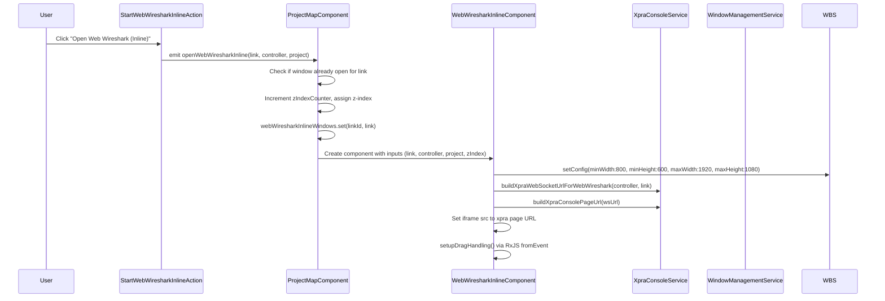
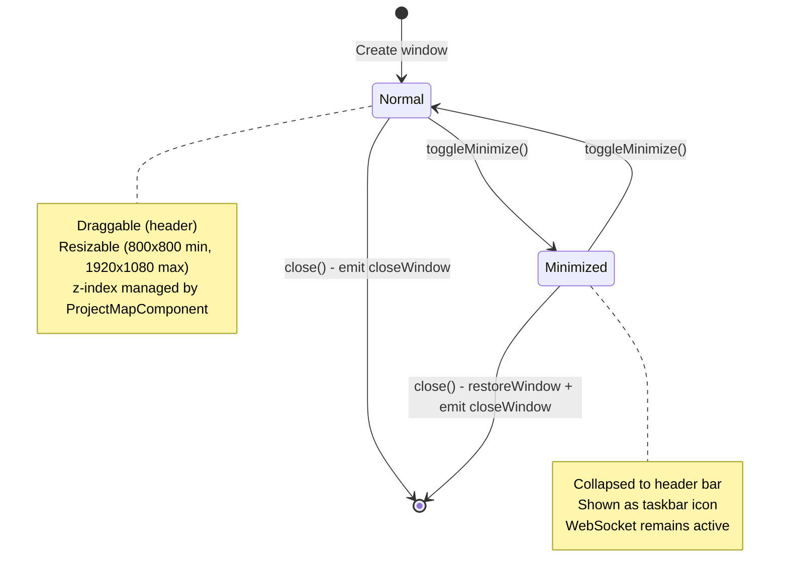
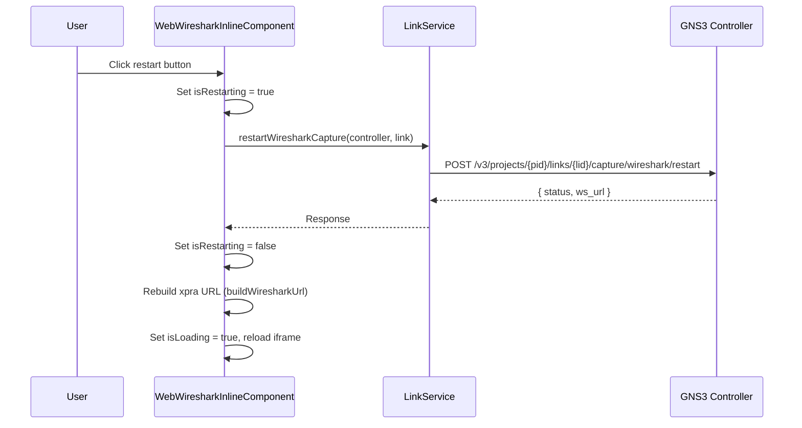
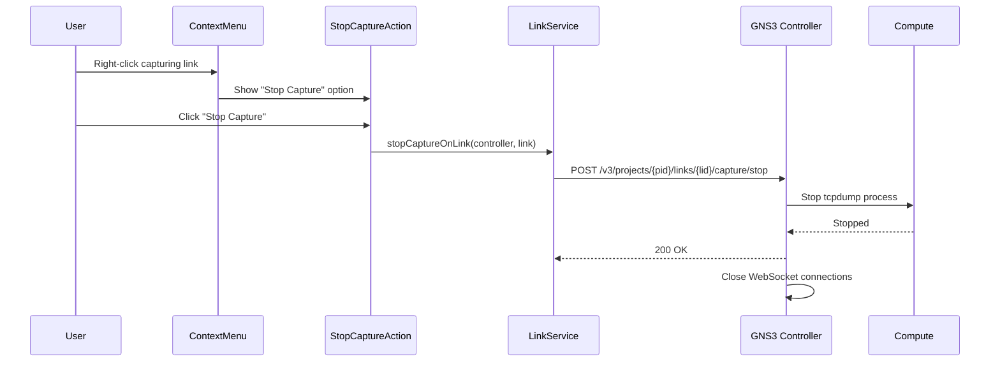

<!--
SPDX-License-Identifier: CC-BY-SA-4.0
See LICENSE file for licensing information.
-->

  > AI-assisted documentation. [See disclaimer](../../README.md). 

# Web Wireshark

## Architecture Overview

### Component Responsibilities

| Component | Responsibility |
|-----------|---------------|
| ProjectMapComponent | Manages inline window lifecycle (open/close/z-index), tracks open windows via `Map<linkId, Link>` |
| ContextMenuComponent | Shows capture actions based on link state (capturing/not capturing) |
| StartCaptureDialogComponent | Configures capture settings (file name, link type, Web Wireshark toggle) |
| StartWebWiresharkAction | Opens Web Wireshark in new browser tab via xpra-html5 |
| StartWebWiresharkInlineAction | Emits event to ProjectMapComponent to open inline window |
| WebWiresharkInlineComponent | Draggable/resizable iframe container for xpra-html5, manages window UI state |

### Service Responsibilities

| Service | Responsibility |
|---------|---------------|
| LinkService | HTTP communication with controller for capture start/stop/restart |
| XpraConsoleService | Builds WebSocket URLs and xpra-html5 page URLs from controller/link data |
| WindowManagementService | Tracks minimized window state via Angular signal, shared across all window types |
| WindowBoundaryService | Constrains window position/size to viewport boundaries |
| PacketCaptureService | Opens native Wireshark via `gns3+pcap://` protocol handler |

---

## Flow Description

### Capture Start with Web Wireshark

### Web Wireshark New Tab Mode

### Web Wireshark Inline Mode

### Inline Window Lifecycle

### Restart Capture Flow

### Stop Capture Flow

---

## Implementation Logic

### Z-Index Management

Z-index is managed directly by `ProjectMapComponent`, not by `WindowManagementService`. The component maintains a `zIndexCounter` starting at 0 and a `baseZIndex` of 1000. Each new window (Wireshark, console, web console) increments the counter and gets `baseZIndex + zIndexCounter` as its z-index. When a window is focused, the counter increments again and the window receives the new highest value. This ensures the most recently focused window is always on top.

The z-index state is stored in `Map<linkId, zIndex>` maps (`webWiresharkInlineZIndex`, `webConsoleInlineZIndex`) and passed to child components via signal inputs.

### Window Boundary Constraint

`WindowBoundaryService` provides reusable viewport boundary logic. `WebWiresharkInlineComponent` configures it with the actual constraints: minimum size 800x600, maximum size 1920x1080, plus a top offset equal to the toolbar height (64px desktop, 56px mobile). During drag, the component uses `Renderer2` to apply position directly to DOM for performance, bypassing Angular change detection on every mouse move. Iframe pointer events are disabled during drag/resize to prevent iframe from stealing mouse events.

### Minimized State Management

`WindowManagementService` is a signal-based service (`providedIn: 'root'`) that tracks only the minimized window list. Its `MinimizedWindow` interface stores `id` (format: `wireshark-{linkId}`), `type` (`'console' | 'wireshark'`), and optional `linkId`. The `WebWiresharkInlineComponent` uses an `effect()` to sync its local `isMinimizedSignal` with the service state. Minimized windows appear as taskbar icons at the bottom of the project map, with positions calculated by `ProjectMapComponent.getWiresharkTaskbarLeft()`.

### xpra URL Construction

`XpraConsoleService` handles the two-step URL construction:

1. **WebSocket URL**: Converts controller protocol (`http`/`https`) to WebSocket protocol (`ws`/`wss`), then builds: `{ws|wss}://{host}:{port}/v3/projects/{pid}/links/{lid}/capture/web-wireshark?token={authToken}`

2. **xpra-html5 page URL**: Parses the WebSocket URL to extract `server`, `port`, `ssl`, `path+query`, then builds: `/assets/xpra-html5/index.html?server={server}&port={port}&ssl={ssl}&path={path}?token={token}&sound=true&clipboard=true&encoding=h264`

The page URL is marked as safe via `DomSanitizer.bypassSecurityTrustResourceUrl()` before being set as iframe `src`.

### Capture Dialog Logic

`StartCaptureDialogComponent` supports two modes controlled by the `webWireshark` model signal. When Web Wireshark is checked, the dialog shows a loading spinner during the API call and provides detailed error messages for HTTP 409 (capture already running), 404 (link not found), and 403 (permission denied) status codes. The dialog also checks if at least one node on the link is running before submitting. The auto-generated file name format is `{sourceNode}_{sourcePort}_to_{targetNode}_{targetPort}` with non-alphanumeric characters stripped.

### Key Source Files

| File | Purpose |
|------|---------|
| `src/app/components/project-map/web-wireshark-inline/web-wireshark-inline.component.ts` | Inline window component |
| `src/app/components/project-map/context-menu/actions/start-web-wireshark-action/` | New tab action |
| `src/app/components/project-map/context-menu/actions/start-web-wireshark-inline-action/` | Inline action |
| `src/app/components/project-map/packet-capturing/start-capture/` | Capture configuration dialog |
| `src/app/services/xpra-console.service.ts` | xpra URL builder |
| `src/app/services/link.service.ts` | Capture REST API calls |
| `src/app/services/window-management.service.ts` | Minimized state tracking |
| `src/app/services/window-boundary.service.ts` | Viewport boundary constraints |
| `src/app/services/packet-capture.service.ts` | Native Wireshark launch |
| `src/app/models/capturingSettings.ts` | Capture settings model |
