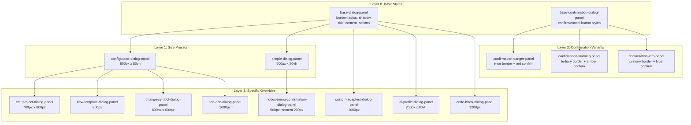
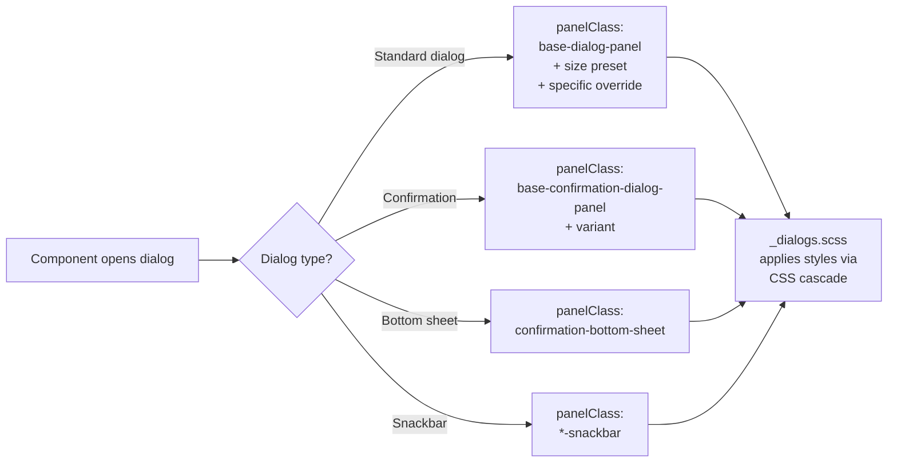

<!--
SPDX-License-Identifier: CC-BY-SA-4.0
See LICENSE file for licensing information.
-->
# Dialog Style Migration Record

**Migration Date**: 2026-03-29
**Branch**: refactor/move-dialog-styles-to-css
**Standard**: CLAUDE.md - "No style overrides in TS"

---

## Architecture Overview

### Class Inheritance Model

All dialogs use a layered panelClass array. Each layer adds styling:

| Layer | Responsibility | Example |
|-------|---------------|---------|
| **Base** | Typography, spacing, shadows | `base-dialog-panel` |
| **Size Preset** | Width, height, max dimensions | `configurator-dialog-panel` or `simple-dialog-panel` |
| **Confirmation Variant** | Color theme for confirm dialogs | `confirmation-danger-panel` |
| **Specific Override** | Unique sizing for a single dialog | `edit-project-dialog-panel` |

---

## Flow Description

### Style Resolution Flow

1. Component calls `dialog.open()` with `panelClass` array
2. Angular Material applies each CSS class to the overlay container
3. `_dialogs.scss` selectors match via `.panel-class .mat-mdc-dialog-container`
4. CSS cascade applies styles from base to specific (left to right in array)
5. Later classes override earlier ones when conflicts exist

---

## Implementation Logic

### DialogConfigService (P0)

Centralized configuration service in `src/app/services/dialog-config.service.ts`. Pre-registers named dialog configs that combine base + preset + override classes.

| Config Name | panelClass Chain | Size |
|-------------|-----------------|------|
| `changeSymbol` | base + configurator + change-symbol | 800px x 600px |
| `templateSymbol` | base + configurator + change-symbol | 800px x 600px |
| `symbolsManager` | base + configurator | 800px x 80vh |
| `confirmation` | base-confirmation + danger | Auto |
| `editController` | base + edit-controller | 400px |
| `addController` | base + add-controller | 350px |
| `customAdapters` | base + custom-adapters | 1000px |
| `editProject` | base + configurator + edit-project | 700px x 600px |
| `addAce` | base + configurator + add-ace | 1000px |
| `newTemplate` | base + configurator + new-template | 800px |
| `nodesMenuConfirmation` | base + simple + nodes-menu-confirmation | 500px x 200px |
| `startCapture` | base + simple | 500px x 80vh |
| `linkStyleEditor` | base + simple | 500px x 80vh |
| `packetFilters` | base + simple | 500px x 80vh |
| `helpDialog` | base + simple | 500px x 80vh |

**Note**: Most components still call `dialog.open()` directly with inline panelClass arrays rather than using `DialogConfigService.getConfig()`. Only `DialogConfigService` test coverage exercises these configs currently.

---

### Project Management

| CSS Class | Size | Component File | Method |
|-----------|------|---------------|--------|
| `choose-name-dialog-panel` | 400px | projects.component.ts | `duplicate()` |
| `add-blank-project-dialog-panel` | 400px | projects.component.ts | `addBlankProject()` |
| `import-project-dialog-panel` | 400px | projects.component.ts | `importProject()` |
| `delete-all-projects-dialog-panel` | 550px x 650px | projects.component.ts | `confirmDeleteAllProjects()` |
| `simple-dialog-panel` | 500px x 80vh | projects.component.ts | `exportPortableProjectDialog()` |

| CSS Class | Size | Component File | Method |
|-----------|------|---------------|--------|
| `configurator-dialog-panel` + `edit-project-dialog-panel` | 700px x 600px | projects.component.ts | `editProject()` |
| `configurator-dialog-panel` + `edit-project-dialog-panel` | 700px x 600px | project-map.component.ts | `editProject()` |

---

### Image Manager

| CSS Class | Size | Component File | Methods |
|-----------|------|---------------|---------|
| `question-dialog-panel` | 450px | image-manager.component.ts | `deleteFile()`, `installAllImages()` |
| `question-dialog-panel` (info variant) | 450px | image-manager.component.ts | `pruneImages()` |
| `add-image-dialog-panel` | 600px x 550px | image-manager.component.ts | `addImage()` |
| `delete-all-images-dialog-panel` | 550px x 650px | image-manager.component.ts | `deleteAllFiles()` |

---

### User / Role / Group Management

| CSS Class | Size | Component File | Method |
|-----------|------|---------------|--------|
| `add-user-dialog-panel` | 400px | user-management.component.ts | `addUser()` |
| `change-user-password-dialog-panel` | 400px x 400px | logged-user.component.ts | `changePassword()` |
| `change-user-password-dialog-panel` | 400px x 400px | user-detail-dialog.component.ts | password change |
| `ai-profile-dialog-panel` | 700px x 80vh | ai-profile-tab.component.ts | `openCreateDialog()`, `openEditDialog()` |
| `ai-profile-dialog-panel` | 700px x 80vh | group-ai-profile-tab.component.ts | `openCreateDialog()`, `openEditDialog()` |
| `add-user-to-group-dialog-panel` | 700px x 500px | group-detail-dialog.component.ts | `addUserToGroup()` |

---

### Node Editors

| CSS Class | Size | Component File | Method |
|-----------|------|---------------|--------|
| `qemu-configurator-dialog-panel` | 500px | configurator-qemu.component.ts | `openCustomAdaptersDialog()` |
| `docker-configurator-dialog-panel` | 800px | configurator-docker.component.ts | `openCustomAdaptersDialog()` |
| `docker-configurator-dialog-panel` | 800px | config-action.component.ts | `openDockerConfigurator()` |
| `custom-adapters-dialog-panel` | 1000px | configurator-qemu/virtualbox/vmware components | `openCustomAdaptersDialog()` |

**Note**: All node configurators (QEMU, Docker, VirtualBox, VMware, IOU, VPCS, Cloud, Ethernet Switch, Ethernet Hub, NAT, ATM Switch) open their main dialog with `configurator-dialog-panel` (800px x 80vh).

---

### Context Menu Actions

| CSS Class | Size | Component File | Menu Action |
|-----------|------|---------------|-------------|
| `idle-pc-action-dialog-panel` | 500px | idle-pc-action.component.ts | Idle PC |
| `export-config-action-dialog-panel` | 500px | export-config-action.component.ts | Export Config |
| `import-config-action-dialog-panel` | 500px | import-config-action.component.ts | Import Config |
| `show-node-action-dialog-panel` | 600px x 600px | show-node-action.component.ts | Show Node |
| `edit-text-action-dialog-panel` | 300px | edit-text-action.component.ts | Edit Text |
| `edit-config-action-dialog-panel` | 600px x 500px | edit-config-action.component.ts | Edit Config |
| `edit-style-action-dialog-panel` | 500px | edit-style-action.component.ts | Edit Style |

---

### Controllers

| CSS Class Chain | Size | Component File | Method |
|----------------|------|---------------|--------|
| `controller-small-dialog-panel` + `add-controller-dialog-panel` | 350px | controllers.component.ts | `createModal()` |
| `controller-dialog-panel` + `edit-controller-dialog-panel` | 400px | controllers.component.ts | `editController()` |

---

### Template Management

| CSS Class | Size | Component File | Method |
|-----------|------|---------------|--------|
| `template-dialog-panel` | 600px | template.component.ts | `openDialog()` |
| `template-name-dialog-panel` | 400px | new-template-dialog.component.ts | import/create/edit template name |
| `new-template-dialog-panel` | 800px | default-layout.component.ts | `openNewTemplateDialog()` |

---

### Confirmation Dialogs

Used across all management components for delete/warning confirmations.

| Variant | panelClass | Color Theme |
|---------|-----------|-------------|
| **Danger** | base-confirmation + confirmation-danger | Error red |
| **Warning** | base-confirmation + confirmation-warning | Tertiary amber |
| **Info** | base-confirmation + confirmation-info | Primary blue |
| **Info (with size)** | base-confirmation + information-dialog | Primary, 500px |

Components using confirmations: user-management, acl-management, computes, group-management, resource-pools, role-management, snapshots, projects, image-manager, preferences.

---

### AI Chat

| CSS Class | Size | Component File | Method |
|-----------|------|---------------|--------|
| `code-block-dialog-panel` | 1200px | chat-message-list.component.ts | `openCodeBlockDialog()` |
| `tool-details-dialog` | Auto | chat-message-list.component.ts | `openToolDetailsDialog()`, `openToolDocumentation()` |

---

### Bottom Sheets & Snackbars

| Type | CSS Class | Used In |
|------|-----------|---------|
| Bottom sheet | `confirmation-bottom-sheet` | controllers, projects, project-map delete actions |
| Upload snackbar | `uplaoding-file-snackabar` | import-project, add-ios/iou/qemu templates |
| AI chat error | `ai-chat-snack-error` | ai-chat.component.ts |

---

## Statistics Summary

| Category | Count |
|----------|-------|
| **Unique CSS Panel Classes** | 45 |
| **Total CSS Lines** | 1108 |
| **Registered DialogConfig Names** | 15 |
| **Component Files Using panelClass** | 78 |

---

## Standards Compliance

- CLAUDE.md - "No style overrides in TS"
- CLAUDE.md - "Dialog styles centralized"
- CLAUDE.md - "Use `panelClass` for dialog style scoping"

All dialog sizing is managed centrally in `src/styles/_dialogs.scss`.

---

## License

This documentation is licensed under the [Creative Commons Attribution-ShareAlike 4.0 International License (CC BY-SA 4.0)](https://creativecommons.org/licenses/by-sa/4.0/).
