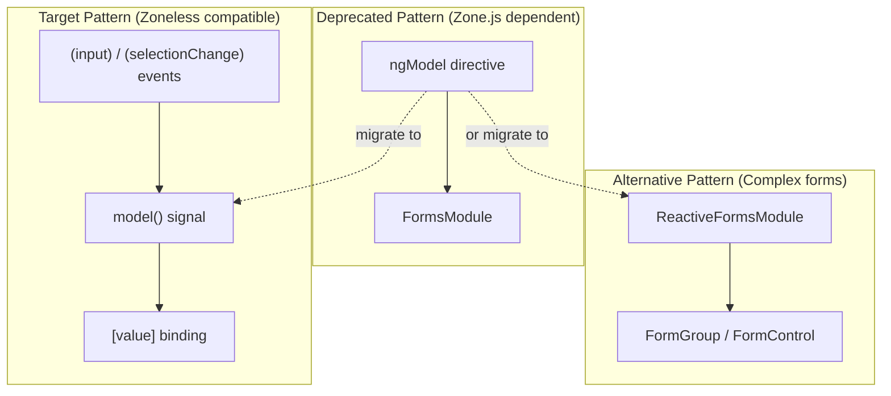
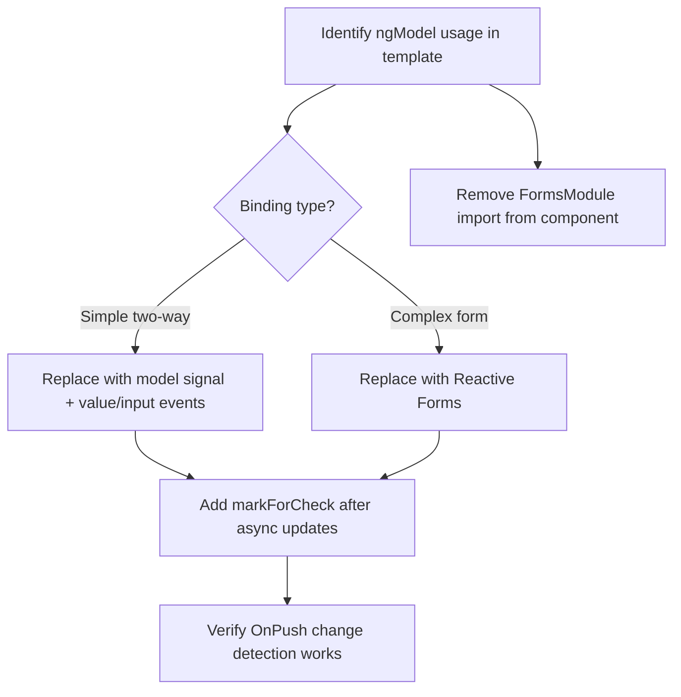

<!--
SPDX-License-Identifier: CC-BY-SA-4.0
See LICENSE file for licensing information.
-->

  > AI-assisted documentation. [See disclaimer](../../README.md). 

# Angular 21 ngModel Migration

## Architecture Overview

## Migration Flow

## Implementation Logic

Angular 21 Zoneless architecture does not support `ngModel` because it relies on Zone.js for change detection. All two-way binding must migrate to either `model()` signals or Reactive Forms.

The migration replaces `ngModel`-based bindings with `model()` signals in the component class, using explicit `[value]` property binding and `(input)` / `(selectionChange)` event handlers in templates. After any asynchronous state update, `ChangeDetectorRef.markForCheck()` must be called to trigger change detection under `OnPush` strategy.

Components with complex form validation should use `ReactiveFormsModule` with `FormGroup` and `FormControl` instead of `model()` signals.

## Migration Progress

**Total: 38 files | Completed: 36 | Pending: 2**

### Pending Files

| File | Remaining Issue |
|------|-----------------|
| `src/app/components/template/template.component.html` | Still uses `[ngModel]` + `(ngModelChange)` with `FormsModule` import |
| `src/app/components/preferences/dynamips/ios-template-details/ios-template-details.component.html` | Still uses `[ngModelOptions]` with `FormsModule` import |

### Completed Files

#### Template Components

| File |
|------|
| `src/app/components/template/template-list-dialog/template-list-dialog.component.html` |

#### Preferences Components

| File |
|------|
| `src/app/components/preferences/qemu/qemu-preferences/qemu-preferences.component.html` |
| `src/app/components/preferences/vpcs/vpcs-preferences/vpcs-preferences.component.html` |
| `src/app/components/preferences/vmware/vmware-preferences/vmware-preferences.component.html` |
| `src/app/components/preferences/virtual-box/virtual-box-preferences/virtual-box-preferences.component.html` |
| `src/app/components/preferences/dynamips/dynamips-preferences/dynamips-preferences.component.html` |
| `src/app/components/preferences/common/symbols/symbols.component.html` |
| `src/app/components/preferences/common/udp-tunnels/udp-tunnels.component.html` |
| `src/app/components/preferences/common/ports/ports.component.html` |
| `src/app/components/preferences/common/custom-adapters-table/custom-adapters-table.component.html` |
| `src/app/components/preferences/common/custom-adapters/custom-adapters.component.html` |

#### Project-Map Components

| File |
|------|
| `src/app/components/project-map/drawings-editors/style-editor/style-editor.component.html` |
| `src/app/components/project-map/drawings-editors/text-editor/text-editor.component.html` |
| `src/app/components/project-map/ai-chat/chat-input-area.component.html` |
| `src/app/components/project-map/packet-capturing/packet-filters/packet-filters.component.html` |
| `src/app/components/project-map/packet-capturing/start-capture/start-capture.component.html` |
| `src/app/components/project-map/node-editors/configurator/docker/edit-network-configuration/edit-network-configuration.component.html` |
| `src/app/components/project-map/node-editors/configurator/docker/configure-custom-adapters/configure-custom-adapters.component.html` |
| `src/app/components/project-map/node-editors/config-editor/config-editor.component.html` |
| `src/app/components/project-map/node-editors/configurator/cloud/configurator-cloud.component.html` |
| `src/app/components/project-map/new-template-dialog/new-template-dialog.component.html` |
| `src/app/components/project-map/log-console/log-console.component.html` |
| `src/app/components/project-map/context-menu/dialogs/idle-pc-dialog/idle-pc-dialog.component.html` |

#### Management Components

| File |
|------|
| `src/app/components/controllers/controllers.component.html` |
| `src/app/components/projects/projects.component.html` |
| `src/app/components/projects/edit-project-dialog/edit-project-dialog.component.html` |
| `src/app/components/projects/choose-name-dialog/choose-name-dialog.component.html` |
| `src/app/components/user-management/user-management.component.html` |
| `src/app/components/role-management/role-management.component.html` |
| `src/app/components/settings/settings.component.html` |
| `src/app/components/resource-pools-management/resource-pools-management.component.html` |
| `src/app/components/image-manager/image-manager.component.html` |
| `src/app/components/group-management/group-detail-dialog/group-detail-dialog.component.html` |
| `src/app/components/group-management/group-management.component.html` |
| `src/app/components/group-details/add-user-to-group-dialog/add-user-to-group-dialog.component.html` |
| `src/app/components/acl-management/acl-management.component.html` |

---

## License

This documentation is licensed under the [Creative Commons Attribution-ShareAlike 4.0 International License (CC BY-SA 4.0)](https://creativecommons.org/licenses/by-sa/4.0/).
