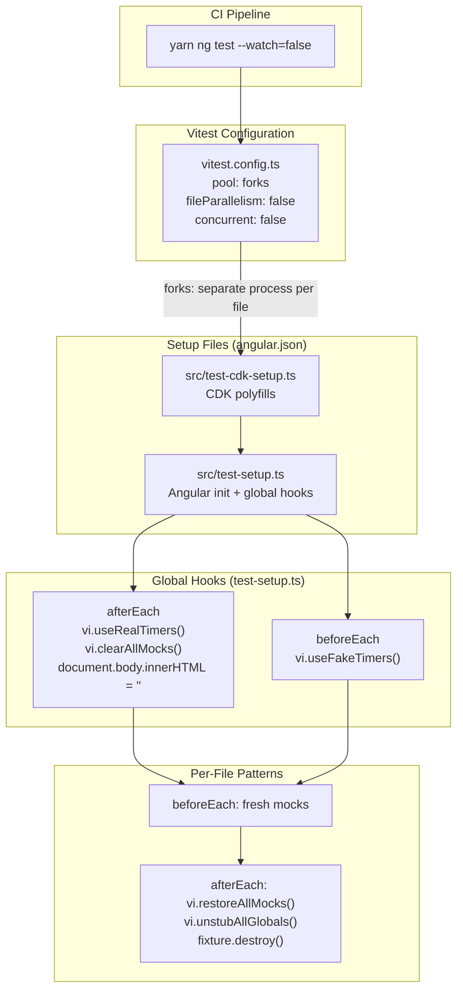
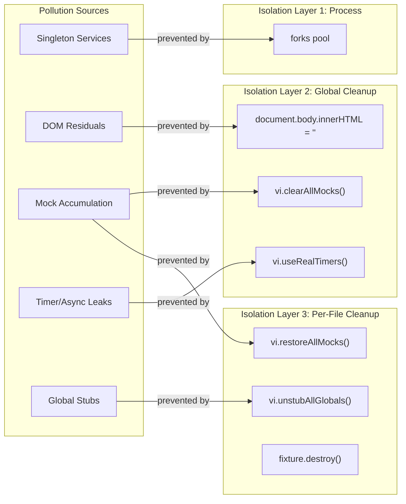
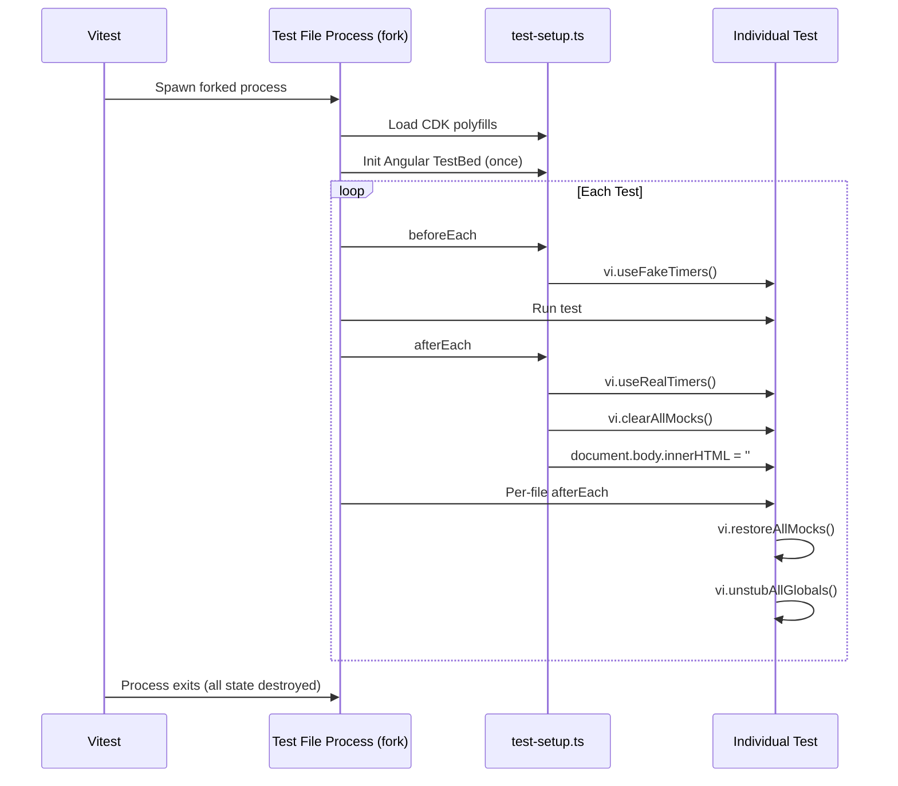

<!--
SPDX-License-Identifier: CC-BY-SA-4.0
See LICENSE file for licensing information.
-->
# Vitest Test Isolation and Environment Pollution Guide

> Architecture and flow documentation for test isolation in Angular 21 + Vitest

**Last Updated**: 2026-04-19
**Angular Version**: 21.0.0 (Zoneless)
**Testing Framework**: Vitest 4.1.2
**Status**: Production Ready

---

## Architecture Overview

Test environment pollution occurs when multiple test files share mutable global state across test boundaries. The isolation architecture uses a three-layer defense: process-level isolation via Vitest configuration, global cleanup hooks in test setup files, and per-test-file cleanup patterns.

### Setup File Load Order

The `angular.json` test builder loads setup files in sequence:

1. **`src/test-cdk-setup.ts`** — Polyfills for Angular CDK (MediaMatcher, FocusMonitor, HighContrastModeDetector) that require browser APIs not available in JSDOM
2. **`src/test-setup.ts`** — Angular TestBed initialization and global cleanup hooks

---

## Pollution Source Flow

### Pollution Source Descriptions

| Source | Mechanism | Prevention Layer |
|--------|-----------|-----------------|
| **Singleton Services** | Angular DI creates single instances that persist across tests within the same process | `forks` pool gives each test file its own process |
| **DOM Residuals** | Dialogs, overlays, toasts remain in `document.body` after test completes | Global `afterEach` clears `document.body.innerHTML` |
| **Mock Accumulation** | Call counts and return values on `vi.fn()` mocks persist across tests | Global `vi.clearAllMocks()` in `afterEach`; per-file `vi.restoreAllMocks()` |
| **Timer/Async Leaks** | Unsubscribed Observables or `setTimeout` callbacks fire in later tests | Global `vi.useFakeTimers()` in `beforeEach`; `vi.useRealTimers()` in `afterEach` |
| **Global Stubs** | `vi.stubGlobal()` modifications (WebSocket, localStorage) leak across tests | Per-file `vi.unstubAllGlobals()` in `afterEach` |

---

## Test Lifecycle Flow

---

## Implementation Logic

### Process-Level Isolation

The `vitest.config.ts` configures Vitest to use the `forks` pool instead of the default `threads` pool. This means each test file runs in a separate child process with its own memory space. When a test file finishes, its process exits and all in-memory state (Angular DI singletons, global variables, module cache) is destroyed. The configuration also disables file parallelism and concurrency to ensure tests run serially, eliminating race conditions from parallel execution.

### Global Setup and Cleanup

The `src/test-setup.ts` file performs two responsibilities:

**Initialization** — Calls `TestBed.initTestEnvironment()` with `BrowserDynamicTestingModule` and enables `destroyAfterEach: true` so Angular automatically destroys component fixtures between tests. This is guarded by `if (!TestBed.platform)` to prevent duplicate initialization when the Angular CLI has already set up the environment.

**Global hooks** — Installs fake timers in `beforeEach` to intercept all `setTimeout`/`setInterval` calls, preventing real async operations from leaking between tests. The `afterEach` hook restores real timers, clears all mock call counts and implementations, and removes any leftover DOM elements by clearing `document.body.innerHTML`.

### CDK Polyfills

The `src/test-cdk-setup.ts` runs before the main setup and patches JSDOM environments for Angular CDK components that expect browser APIs. It ensures `document.body` exists with `querySelector`, `querySelectorAll`, and `classList` methods, and provides `window.addEventListener`/`removeEventListener` stubs.

### Per-File Isolation Patterns

Individual test files apply additional cleanup on top of the global hooks:

- **Fresh mocks in `beforeEach`** — Services and dependencies are recreated as new `vi.fn()` instances rather than being reused from module scope
- **`vi.restoreAllMocks()`** in `afterEach` — Restores original implementations of spied methods
- **`vi.unstubAllGlobals()`** in `afterEach` — Removes any `vi.stubGlobal()` modifications (WebSocket, localStorage, etc.)
- **`fixture.destroy()` with error handling** — Complex components with child components may throw during destruction; try-catch wrappers prevent cleanup errors from masking real test failures
- **Explicit `TestBed.resetTestingModule()`** — Used selectively within individual tests that need a completely fresh Angular DI context (e.g., testing service initialization with different configurations)

---

## Key Configuration Files

| File | Responsibility |
|------|---------------|
| `vitest.config.ts` | Process isolation: `forks` pool, serial execution |
| `src/test-cdk-setup.ts` | JSDOM polyfills for Angular CDK |
| `src/test-setup.ts` | Angular TestBed init, fake timers, mock/DOM cleanup |
| `angular.json` | Wires setup files to test builder via `setupFiles` array |

---

## References

### Internal Documentation

- [Vitest Testing Setup](./vitest-testing-setup.md) — Base configuration
- [Angular Zoneless Guide](./zoneless-guide.md) — Zoneless patterns
- [CLAUDE.md](../../../CLAUDE.md) — Development standards

### External Resources

- [Vitest Pool Options](https://vitest.dev/guide/cli.html#options)
- [Angular TestBed API](https://angular.dev/api/core/testing/TestBed)

---

## Changelog

### 2026-04-19

- Rewritten to match actual codebase: corrected global cleanup hooks, added CDK setup file, removed fabricated CI section
- Restructured to documentation standard: architecture diagrams, flow diagrams, text descriptions only

### 2026-04-03

- Initial documentation

---

**Document Status**: Active
**Last Reviewed**: 2026-04-19
**Angular Version**: 21.0.0
**Vitest Version**: 4.1.2

---

## License

This documentation is licensed under the [Creative Commons Attribution-ShareAlike 4.0 International License (CC BY-SA 4.0)](https://creativecommons.org/licenses/by-sa/4.0/).
