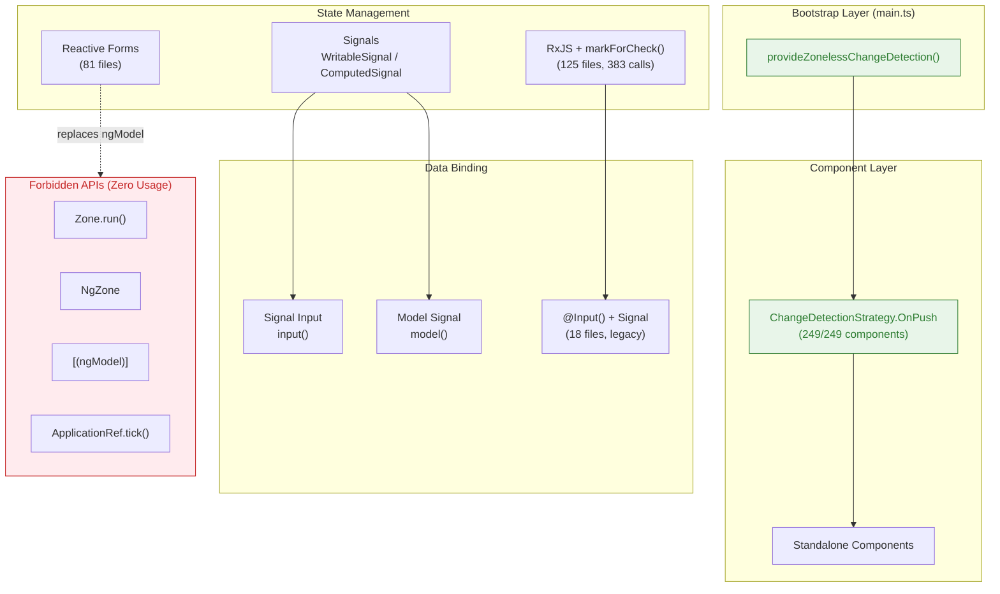
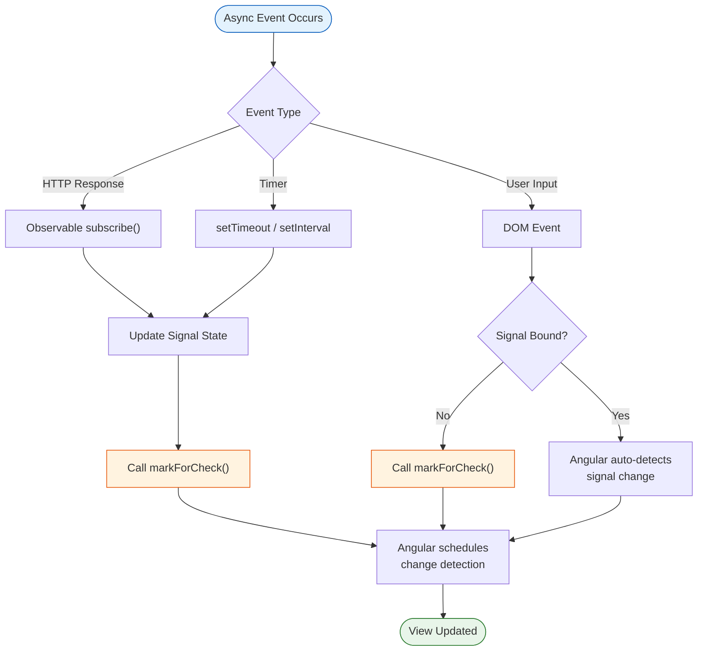
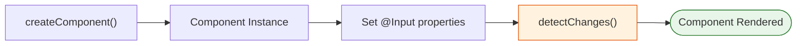

<!--
SPDX-License-Identifier: CC-BY-SA-4.0
See LICENSE file for licensing information.
-->

  > AI-assisted documentation. [See disclaimer](../../README.md). 


# Angular Zoneless Development Guide

> This project uses Angular 21 Zoneless architecture. Zone.js is disabled, and all change detection is explicit.

---

## Architecture Overview



### Component Responsibilities

| Layer | Responsibility | Current Status |
|-------|---------------|----------------|
| **Bootstrap** | Zoneless provider registration | `provideZonelessChangeDetection()` in `main.ts` |
| **Component** | All components standalone + OnPush | 249/249 (100%) |
| **State Management** | Explicit change notification | `markForCheck()` as primary mechanism |
| **Data Binding** | Input/Output signal-based | Legacy `@Input()` migration in progress |

---

## Flow Description

### Change Detection Trigger Flow



### Dynamic Component Loading Flow



---

## Implementation Logic

### Zoneless Architecture Principle

The application bootstraps with `provideZonelessChangeDetection()` which removes Zone.js monkey-patching entirely. Angular no longer auto-detects changes from async operations (HTTP, timers, events). Every state change must explicitly notify Angular's change detector.

### Forbidden APIs and Alternatives

Four APIs are strictly prohibited because they rely on Zone.js infrastructure:

| Forbidden API | Reason | Replacement |
|---------------|--------|-------------|
| `Zone.run()` | Requires Zone.js runtime | `effect()` or direct signal updates |
| `NgZone` | Zone.js dependency | `ChangeDetectorRef.markForCheck()` |
| `[(ngModel)]` | Depends on FormsModule + Zone.js | `model()` signals or Reactive Forms |
| `ApplicationRef.tick()` | Manual full-tree check | `cd.markForCheck()` per component |

### Current Codebase Patterns

The codebase uses four primary patterns for zoneless compatibility:

**Pattern 1: markForCheck() after async operations** — The dominant pattern (383 calls across 125 files). After any Observable subscription callback or timer callback, the component calls `cd.markForCheck()` to notify Angular. This is the most widely adopted mechanism because it integrates naturally with existing RxJS-based services (137 service files).

**Pattern 2: Reactive Forms** — Used in 81 files as the replacement for `ngModel`. Reactive Forms are inherently zoneless-compatible because form control value changes can be subscribed to explicitly, and `markForCheck()` can be called in the subscription.

**Pattern 3: Hybrid Signals + markForCheck()** — Used in partially migrated components. Form fields use `model()` signals, but data properties remain as regular properties that still require `markForCheck()` calls in async callbacks. This is a transitional state that provides some signal benefits but doesn't achieve full zoneless automatic reactivity.

**Pattern 4: Pure Signals (True Zoneless)** ⭐ — The ideal pattern. All component state (form fields + data properties) uses signals (`model()` or `signal()`). Signal changes automatically trigger Angular's change detection without any manual `markForCheck()` calls. This is the Angular 21 recommended approach for true zoneless applications.

### Pattern 4: Pure Signals (True Zoneless) ⭐

**This is the recommended pattern for new components and the target for existing component migrations.**

#### Concept

When all component state is stored in signals, Angular automatically detects and propagates changes without any manual intervention. No `ChangeDetectorRef` dependency, no `markForCheck()` calls, just pure reactive programming.

#### Code Structure

```typescript
import { Component, inject, model, signal } from '@angular/core';

@Component({
  standalone: true,
  changeDetection: ChangeDetectionStrategy.OnPush,
})
export class PureZonelessComponent {
  // Form fields: use model() for two-way binding
  readonly nodeName = model('');
  readonly useVpiOnly = model(false);

  // Data properties: use signal() for read-only data
  readonly mappings = signal<NodeMapping[]>([]);
  readonly isLoading = signal(false);

  private nodeService = inject(NodeService);

  ngOnInit() {
    // Async operation: signal.set() automatically triggers UI update
    this.nodeService.getNode(this.controller, this.node).subscribe({
      next: (node) => {
        this.nodeName.set(node.name);
        this.mappings.set(node.properties.mappings);
        // ✅ No markForCheck() needed!
      },
      error: (err) => {
        this.isLoading.set(false);
        // ✅ Still no markForCheck()!
      }
    });
  }

  addMapping() {
    // Signal update: automatic UI update
    this.mappings.set([...this.mappings(), newMapping]);
    this.clearInputs();
    // ✅ No markForCheck() needed!
  }
}
```

#### Template

```html
<!-- All inputs use signal getter/setter -->
<mat-form-field>
  <mat-label>Name</mat-label>
  <input matInput [value]="nodeName()" (input)="nodeName.set($event.target.value)" />
</mat-form-field>

<!-- Data sources use signal getter -->
<table mat-table [dataSource]="mappings()">
  <!-- ... -->
</table>
```

#### Zoneless Migration Checklist

Use this checklist to verify a component is fully migrated to Pattern 4:

| Check Item | Status | Notes |
|------------|--------|-------|
| **No ChangeDetectorRef** | ✅ Required | Remove `cd = inject(ChangeDetectorRef)` |
| **No markForCheck() calls** | ✅ Required | Zero calls in the entire component |
| **No FormGroup/FormControl** | ✅ Required | Remove Reactive Forms |
| **No formControlName** | ✅ Required | Use `[value]` + `(input)` instead |
| **No [(ngModel)]** | ✅ Required | Use `model()` signals instead |
| **Form fields use model()** | ✅ Required | All user inputs use `model()` |
| **Data properties use signal()** | ✅ Required | Arrays, objects, maps use `signal()` |
| **Template uses signal getters** | ✅ Required | `[value]="prop()"`, `[dataSource]="data()"` |

#### Example: ATM Switch Migration

**Before (Pattern 3 - Hybrid)**:
```typescript
export class ConfiguratorDialogAtmSwitchComponent {
  private cd = inject(ChangeDetectorRef);

  // Model signals (good)
  readonly nameSignal = model('');

  // Regular properties (bad - need markForCheck)
  nodeMappingsDataSource: NodeMapping[] = [];

  ngOnInit() {
    this.nodeService.getNode().subscribe({
      next: (node) => {
        this.nodeMappingsDataSource = node.mappings;
        this.cd.markForCheck(); // ❌ Manual trigger needed
      }
    });
  }
}
```

**After (Pattern 4 - Pure Signals)**:
```typescript
export class ConfiguratorDialogAtmSwitchComponent {
  // No ChangeDetectorRef needed!

  // Model signals
  readonly nameSignal = model('');

  // Data signals
  readonly nodeMappingsDataSource = signal<NodeMapping[]>([]);

  ngOnInit() {
    this.nodeService.getNode().subscribe({
      next: (node) => {
        this.nodeMappingsDataSource.set(node.mappings);
        // ✅ Automatic UI update!
      }
    });
  }
}
```

**Migration Impact**:
- **Lines removed**: -3 (ChangeDetectorRef import + injection + 5 markForCheck calls)
- **Lines added**: +2 (signal declarations + signal updates)
- **Net result**: Cleaner code, automatic reactivity, true Zoneless

### Known Issues

**Dynamic Component Loading**: `ViewContainerRef.createComponent()` does not automatically trigger change detection in zoneless mode. After creating a component and setting its inputs, `detectChanges()` must be called explicitly on the component's `changeDetectorRef`.

**mat-checkbox Binding**: In zoneless mode, prefer `[checked]` property binding with `(change)` event over `ngModel` for checkboxes. This avoids FormsModule dependency entirely.

---

## References

- [Angular Zoneless Official Docs](https://angular.dev/guide/zoneless)
- [Model Input Signals](https://angular.dev/tutorials/signals/6-two-way-binding-with-model-signals)
- [ChangeDetectorRef](https://angular.dev/api/core/ChangeDetectorRef)

---

## License

This documentation is licensed under the [Creative Commons Attribution-ShareAlike 4.0 International License (CC BY-SA 4.0)](https://creativecommons.org/licenses/by-sa/4.0/).
