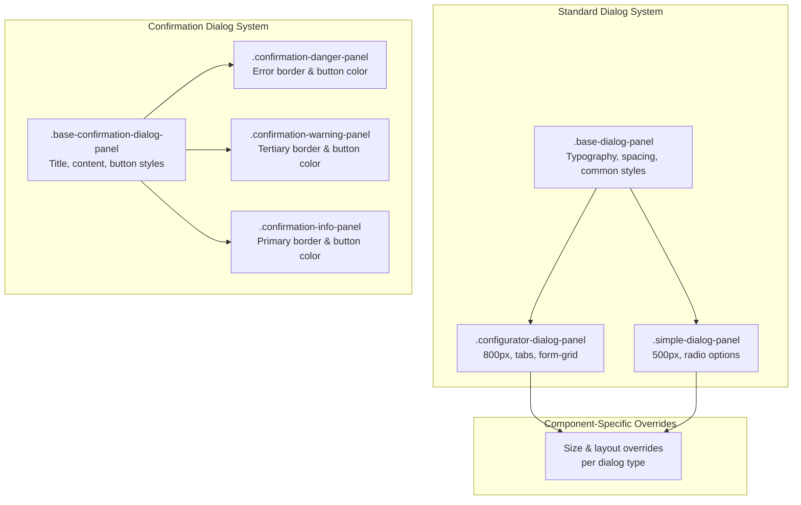
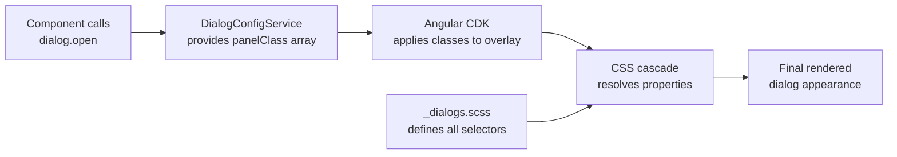

<!--
SPDX-License-Identifier: CC-BY-SA-4.0
See LICENSE file for licensing information.
-->
# Dialog Style Isolation - Dialog Styling Architecture

> Centralized Dialog Styling with Component-Specific Overrides

**Last Updated**: 2026-04-19
**Status**: Active

---

## Architecture Overview

GNS3 Web UI uses a **panelClass array composition** architecture for dialog styling. CSS classes are independent top-level selectors in `_dialogs.scss`; they are combined at runtime via TypeScript `panelClass` arrays. The overlay container element receives multiple classes simultaneously, and CSS cascade resolves overlapping properties.

### Style System Architecture

### Composition Principle

Each panel class is a self-contained SCSS selector. There is no SCSS nesting or CSS inheritance between them. Inheritance is achieved by listing multiple classes in the `panelClass` array. Later classes in the array can override earlier classes through CSS cascade specificity.

---

## Flow Description

### Dialog Style Resolution Flow

### Panel Class Composition Patterns

```mermaid
flowchart TD
    subgraph "Pattern A: Standard Dialog"
        A1["base-dialog-panel"]
    end

    subgraph "Pattern B: Configuration Dialog"
        B1["base-dialog-panel"] --> B2["+ configurator-dialog-panel"]
    end

    subgraph "Pattern C: Simple Sub-Dialog"
        C1["base-dialog-panel"] --> C2["+ simple-dialog-panel"]
    end

    subgraph "Pattern D: Confirmation Dialog"
        D1["base-confirmation-dialog-panel"] --> D2["+ confirmation-danger/warning/info-panel"]
    end

    subgraph "Pattern E: Config + Size Override"
        E1["base-dialog-panel"] --> E2["+ configurator-dialog-panel"] --> E3["+ specific-size-panel"]
    end

    subgraph "Pattern F: Simple + Size Override"
        F1["base-dialog-panel"] --> F2["+ simple-dialog-panel"] --> F3["+ specific-size-panel"]
    end
```

### DialogConfigService Registration Flow

`DialogConfigService` centralizes panel class configuration. It registers named configs, each specifying a `panelClass` array. Components retrieve configs by name and can merge overrides at call time.

---

## Implementation Logic

### Centralized Style File

All dialog styles reside in `src/styles/_dialogs.scss`, imported globally via `src/styles.scss`. This file is the single source of truth for dialog appearance. Components must not define dialog-level styles in their own SCSS files.

### DialogConfigService

`src/app/services/dialog-config.service.ts` registers named dialog configurations. Each config specifies a `panelClass` array following the composition patterns above. The service provides three methods: `getConfig` retrieves a registered config, `openConfig` retrieves and merges overrides, and `registerConfig` allows late registration.

### Base Styles Responsibility

`.base-dialog-panel` provides common visual foundations: dialog surface border-radius (16px) and shadow, title typography (18px, weight 500), content padding (16px 24px 0 24px), action button layout (flex-end, 8px gap), and spacing for form fields, checkboxes, cards, and info notes.

`.base-confirmation-dialog-panel` provides a separate base for confirmation dialogs: surface styling, title with 16px bottom margin, content with on-surface-variant color, action buttons with rounded design, and styled cancel/confirm button variants.

### Sizing Panels Responsibility

Sizing panels override container dimensions and content max-height. They do not duplicate base styles. Instead, they rely on being combined with a base panel via `panelClass` array.

### Panel Classes Reference

#### Core Panels

| Panel Class | Width | Max Height | Purpose |
|-------------|-------|------------|---------|
| `.base-dialog-panel` | — | — | Base typography, spacing, common styles |
| `.base-confirmation-dialog-panel` | — | — | Confirmation dialog base with button styling |
| `.configurator-dialog-panel` | 800px | 80vh | Main config dialogs with tabs and forms |
| `.simple-dialog-panel` | 500px | 80vh | Sub dialogs like Image Creator |

#### Confirmation Variants

Combined with `.base-confirmation-dialog-panel` to style the severity level.

| Panel Class | Border Color | Title Color | Button Color |
|-------------|-------------|-------------|-------------|
| `.confirmation-danger-panel` | error-container | error | error/on-error |
| `.confirmation-warning-panel` | tertiary-container | tertiary | tertiary/on-tertiary |
| `.confirmation-info-panel` | primary-container | primary | primary/on-primary |

#### Configuration Dialog Overrides

Combined with `base-dialog-panel` + `configurator-dialog-panel`.

| Panel Class | Width | Max Height | Purpose |
|-------------|-------|------------|---------|
| `.change-symbol-dialog-panel` | 800px | 600px | Symbol browser |
| `.edit-project-dialog-panel` | 700px | 600px | Project settings editor |
| `.new-template-dialog-panel` | 800px | — | New template creation |
| `.add-ace-dialog-panel` | 1000px | — | Access control entry editor |
| `.custom-adapters-dialog-panel` | 1000px | — | Custom adapter management (600px content) |
| `.docker-configurator-dialog-panel` | 800px | — | Docker node configuration |
| `.qemu-configurator-dialog-panel` | 500px | — | QEMU node configuration |

#### Simple Dialog Overrides

Combined with `base-dialog-panel` + `simple-dialog-panel`.

| Panel Class | Width | Max Height | Purpose |
|-------------|-------|------------|---------|
| `.nodes-menu-confirmation-dialog-panel` | 500px | 200px | Node action confirmation |

#### Standalone Dialog Panels

These panels define their own complete styling without combining with base panels. Some duplicate base styles (a known inconsistency).

| Panel Class | Width | Max Height | Purpose |
|-------------|-------|------------|---------|
| `.edit-controller-dialog-panel` | — | — | Edit controller (duplicates base styles) |
| `.add-controller-dialog-panel` | — | — | Add controller (duplicates base styles) |
| `.controller-dialog-panel` | 400px | — | Controller selection |
| `.controller-small-dialog-panel` | 350px | — | Small controller actions |
| `.information-dialog-panel` | 500px | — | Information display |
| `.confirmation-dialog-panel` | — | — | Transparent container for custom content |

#### Project Management Panels

| Panel Class | Width | Max Height | Purpose |
|-------------|-------|------------|---------|
| `.choose-name-dialog-panel` | 400px | — | Project rename |
| `.add-blank-project-dialog-panel` | 400px | — | Blank project creation |
| `.import-project-dialog-panel` | 400px | — | Project import |
| `.delete-all-projects-dialog-panel` | 550px | 650px | Bulk project deletion |

#### Image Manager Panels

| Panel Class | Width | Max Height | Purpose |
|-------------|-------|------------|---------|
| `.question-dialog-panel` | 450px | — | Image question prompt |
| `.add-image-dialog-panel` | 600px | 550px | Image upload |
| `.delete-all-images-dialog-panel` | 550px | 650px | Bulk image deletion |

#### User/Role/Group Management Panels

| Panel Class | Width | Max Height | Purpose |
|-------------|-------|------------|---------|
| `.add-user-dialog-panel` | 400px | — | User creation |
| `.change-user-password-dialog-panel` | 400px | 400px | Password change |
| `.add-user-to-group-dialog-panel` | 700px | 500px | User-group assignment |

#### Context Menu Action Panels

| Panel Class | Width | Max Height | Purpose |
|-------------|-------|------------|---------|
| `.idle-pc-action-dialog-panel` | 500px | — | Idle PC selector |
| `.export-config-action-dialog-panel` | 500px | — | Config export |
| `.import-config-action-dialog-panel` | 500px | — | Config import |
| `.show-node-action-dialog-panel` | 600px | 600px | Node info display |
| `.edit-text-action-dialog-panel` | 300px | — | Text annotation editor |
| `.edit-config-action-dialog-panel` | 600px | 500px | Config file editor |
| `.edit-style-action-dialog-panel` | 500px | — | Style editor |

#### Other Panels

| Panel Class | Width | Max Height | Purpose |
|-------------|-------|------------|---------|
| `.template-dialog-panel` | 600px | — | Template browser |
| `.template-name-dialog-panel` | 400px | — | Template naming |
| `.ai-profile-dialog-panel` | 700px | 80vh | AI profile configuration |
| `.code-block-dialog-panel` | 1200px | — | Code display (no content padding) |
| `.tool-details-dialog` | — | — | Tool JSON display (ngx-json color vars) |

#### Bottom Sheet

| Panel Class | Purpose |
|-------------|---------|
| `.confirmation-bottom-sheet` | Transparent bottom sheet container |

### Form Layout Patterns

The configurator panel provides two grid layout systems:

- **Two-column form grid**: `.form-grid` with `.form-grid__full` for full-width span
- **Disk card grid**: `.disk-cards-grid` with `.disk-card` for hardware card display
- **Card stack**: `.card-stack` for single-column card layout

### Configurator-Specific Styles

The `.configurator-dialog-panel` includes styles for tab body padding, file upload sections, HDD create sections, custom adapter sections, and tags fields. These are only available when this panel class is applied.

### Rules

- All dialog styles must be in `src/styles/_dialogs.scss`
- Use `panelClass` as an array, not a string
- Use Material Design 3 theme variables (`--mat-sys-*`)
- Do not use `::ng-deep`, `ViewEncapsulation.None`, or hardcoded colors
- Prefer `DialogConfigService` for panel class composition over inline arrays

### Related Files

| File | Purpose |
|------|---------|
| `src/styles/_dialogs.scss` | All dialog style definitions |
| `src/app/services/dialog-config.service.ts` | Panel class composition registry |
| `src/styles.scss` | Imports `_dialogs.scss` globally |
| `src/app/components/project-map/node-editors/configurator/` | Configurator dialog components |

---

**Last Updated**: 2026-04-19

---

## License

This documentation is licensed under the [Creative Commons Attribution-ShareAlike 4.0 International License (CC BY-SA 4.0)](https://creativecommons.org/licenses/by-sa/4.0/).
