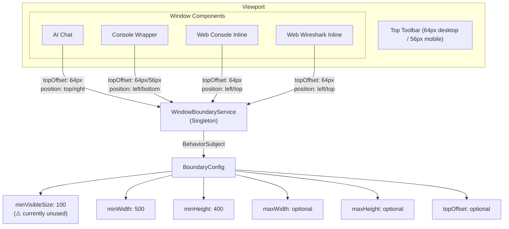
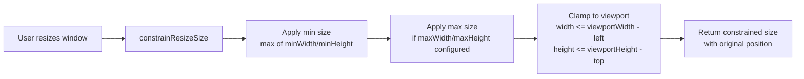
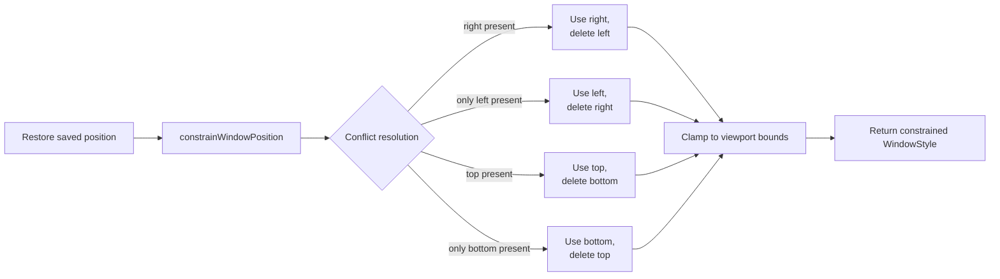

<!--
SPDX-License-Identifier: CC-BY-SA-4.0
See LICENSE file for licensing information.
-->
# WindowBoundaryService

> Ensures windows stay within viewport boundaries and avoid UI element overlap

**Last Updated**: 2026-04-19
**Status**: Active

---

## Architecture Overview



The service is a singleton (`providedIn: 'root'`) shared across all window components. Each component calls `setConfig()` to provide its own `topOffset` based on toolbar height.

---

## Flow Description

### Drag Flow

```mermaid
flowchart LR
    A[User drags window] --> B[constrainDragPosition]
    B --> C{Horizontal axis}
    C -->|right defined| D[Constrain right<br/>right = clamp(right - movementX,<br/>0, viewportWidth - width)]
    C -->|left defined| E[Constrain left<br/>left = clamp(left + movementX,<br/>0, viewportWidth - width)]
    B --> F{Vertical axis}
    F -->|top defined| G[Constrain top<br/>top = clamp(top + movementY,<br/>topOffset, viewportHeight - height)]
    F -->|bottom defined| H[Constrain bottom<br/>bottom = clamp(bottom - movementY,<br/>0, viewportHeight - height - topOffset)]
    D & E & G & H --> I[Return new WindowStyle<br/>position: fixed]
```

### Resize Flow



### Position Restore Flow



---

## Implementation Logic

### Position Mode Priority

When a window style contains conflicting position properties (e.g., both `right` and `left`), the service resolves them with a fixed priority order:

- **Horizontal**: `right` takes priority over `left`
- **Vertical**: `top` takes priority over `bottom`

During `constrainWindowPosition`, the losing property is deleted from the result to prevent CSS conflicts.

### WindowStyle Interface

All methods operate on `WindowStyle` objects, which represent CSS position properties as string values (e.g., `'100px'`). The interface contains `position`, `top`, `right`, `bottom`, `left`, `width`, and `height` — all optional.

### Configuration Management

The service exposes four configuration methods: `getConfig()` returns an Observable for reactive consumers, `getConfigValue()` returns a synchronous snapshot, `setConfig()` merges partial updates into the current config, and `resetConfig()` restores defaults.

Components call `setConfig({ topOffset: toolbarHeight })` during initialization to establish the toolbar exclusion zone. Since the service is a singleton, the last `setConfig()` call wins — each component overwrites the previous configuration.

### Pixel Parsing Cache

The service maintains an internal `Map<string, number>` cache for parsed pixel values (e.g., `'100px'` to `100`). This avoids repeated string splitting and number conversion during high-frequency drag operations.

### Size Validation

The `isValidSize()` method accepts `unknown` typed inputs and handles type coercion for `number`, `string`, and invalid values. It checks against `minWidth`/`minHeight` lower bounds and `maxWidth`/`maxHeight` upper bounds (if configured). Invalid inputs (objects, null, undefined, non-numeric strings) are treated as 0 and will fail the minimum check.

### Known Limitation: `minVisibleSize`

The `minVisibleSize` property exists in the `BoundaryConfig` interface and defaults to `100`, but is currently unused by any service method. This field was intended for ensuring a minimum visible portion of the window remains on screen but was never implemented in the constraint logic.

---

## License

This documentation is licensed under the [Creative Commons Attribution-ShareAlike 4.0 International License (CC BY-SA 4.0)](https://creativecommons.org/licenses/by-sa/4.0/).
