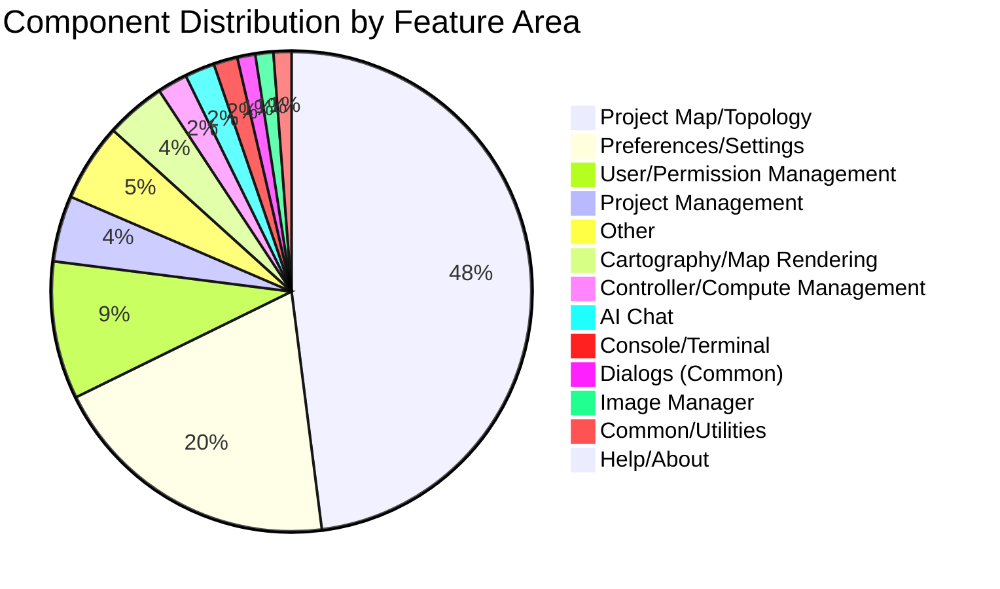
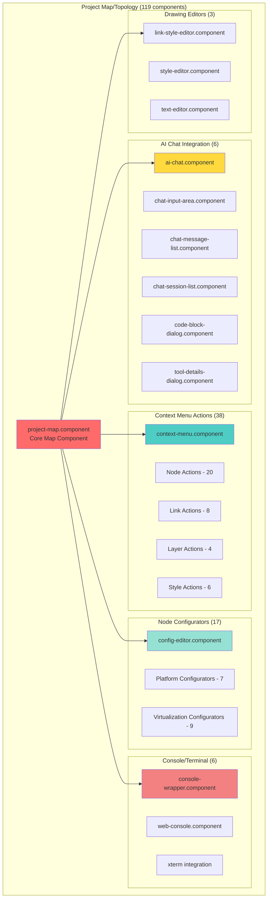

<!--
SPDX-License-Identifier: CC-BY-SA-4.0
See LICENSE file for licensing information.
-->

  > AI-assisted documentation. [See disclaimer](../README.md). 

# GNS3 Web UI - Component Inventory by Feature

> Complete catalog of all components categorized by feature area

**Last Updated**: 2026-04-26
**Total Components**: 249

---

## Summary

| Feature Area | Components | Percentage | Description |
|--------------|------------|------------|-------------|
| Project Map/Topology | 119 | 47.8% | Network topology visualization and editing |
| Preferences/Settings | 49 | 19.7% | Template and preference management |
| User/Permission Management | 23 | 9.2% | User, group, role management |
| Project Management | 11 | 4.4% | Project CRUD, snapshots, import/export |
| Cartography/Map Rendering | 10 | 4.0% | D3.js map rendering components |
| Controller/Compute Management | 5 | 2.0% | Controller and compute management |
| Console/Terminal | 4 | 1.6% | Console and terminal components |
| Dialogs (Common) | 3 | 1.2% | Common dialog components |
| AI Chat | 5 | 2.0% | AI chat interface |
| Image Manager | 3 | 1.2% | Image upload and management |
| Help/About | 1 | 0.4% | Help and documentation |
| Common/Utilities | 3 | 1.2% | Progress indicators, upload bars |
| Other | 13 | 5.2% | Layout, login, ACL, etc. |

---

## Component Distribution Architecture

---

## 1. Project Map/Topology (119 components)

The largest feature area, containing the main project map visualization, context menu actions, node configurators, and console interfaces.

### Project Map Architecture

### Core Map Component
- `project-map.component.ts` - Main project map view with D3.js rendering

### AI Chat Integration (6 components)
- `ai-chat.component.ts` - Main AI chat panel
- `chat-input-area.component.ts` - Chat input area
- `chat-message-list.component.ts` - Chat message list
- `chat-session-list.component.ts` - Chat session history
- `code-block-dialog.component.ts` - Code block display dialog
- `tool-details-dialog.component.ts` - Tool execution details dialog

### Context Menu Actions (38 components)
Right-click context menu actions for node/link manipulation:
- `context-menu.component.ts` - Main context menu
- `align-horizontally.component.ts` - Align nodes horizontally
- `align-vertically.component.ts` - Align nodes vertically
- `auto-idle-pc-action.component.ts` - Auto-set idle PC
- `bring-to-front-action.component.ts` - Bring to front layer
- `change-hostname-action.component.ts` - Change node hostname
- `change-symbol-action.component.ts` - Change node symbol
- `config-action.component.ts` - Configure node
- `console-device-action.component.ts` - Console device action
- `console-device-action-browser.component.ts` - Console browser action
- `delete-action.component.ts` - Delete nodes/links
- `duplicate-action.component.ts` - Duplicate nodes
- `edit-config-action.component.ts` - Edit configuration
- `edit-link-style-action.component.ts` - Edit link style
- `edit-style-action.component.ts` - Edit drawing style
- `edit-text-action.component.ts` - Edit text
- `export-config-action.component.ts` - Export configuration
- `http-console-action.component.ts` - HTTP console
- `http-console-new-tab-action.component.ts` - HTTP console in new tab
- `idle-pc-action.component.ts` - Set idle PC
- `import-config-action.component.ts` - Import configuration
- `isolate-node-action.component.ts` - Isolate node from network
- `lock-action.component.ts` - Lock/unlock node position
- `move-layer-down-action.component.ts` - Move layer down
- `move-layer-up-action.component.ts` - Move layer up
- `open-file-explorer-action.component.ts` - Open file explorer
- `packet-filters-action.component.ts` - Configure packet filters
- `reload-node-action.component.ts` - Reload node
- `reset-link-action.component.ts` - Reset link
- `resume-link-action.component.ts` - Resume suspended link
- `show-node-action.component.ts` - Show node
- `start-capture-on-started-link.component.ts` - Start capture on started link
- `start-capture-action.component.ts` - Start packet capture
- `start-node-action.component.ts` - Start node
- `start-web-wireshark-action.component.ts` - Start web Wireshark
- `start-web-wireshark-inline-action.component.ts` - Start inline web Wireshark
- `stop-capture-action.component.ts` - Stop packet capture
- `stop-node-action.component.ts` - Stop node
- `suspend-link-action.component.ts` - Suspend link
- `suspend-node-action.component.ts` - Suspend node
- `unisolate-node-action.component.ts` - Unisolate node

### Context Menu Dialogs
- `config-dialog.component.ts` - Configuration dialog
- `idle-pc-dialog.component.ts` - Idle PC selection dialog

### Drawing Editors (3 components)
- `link-style-editor.component.ts` - Link style editor
- `style-editor.component.ts` - Drawing style editor
- `text-editor.component.ts` - Text editor

### Node Configurators (17 components)
Configuration dialogs for different node types:
- `config-editor.component.ts` - Generic config editor
- `configurator-atm-switch.component.ts` - ATM switch configurator
- `configurator-cloud.component.ts` - Cloud node configurator
- `configurator-docker.component.ts` - Docker container configurator
- `configure-custom-adapters.component.ts` - Custom adapters configuration
- `edit-network-configuration.component.ts` - Network configuration editor
- `configurator-ethernet-hub.component.ts` - Ethernet hub configurator
- `configurator-ethernet-switch.component.ts` - Ethernet switch configurator
- `configurator-ios.component.ts` - IOS router configurator
- `configurator-iou.component.ts` - IOU configurator
- `configurator-nat.component.ts` - NAT configurator
- `configurator-qemu.component.ts` - QEMU VM configurator
- `qemu-image-creator.component.ts` - QEMU image creator
- `configurator-switch.component.ts` - Switch configurator
- `configurator-virtualbox.component.ts` - VirtualBox VM configurator
- `configurator-vmware.component.ts` - VMware VM configurator
- `configurator-vpcs.component.ts` - VPCS configurator

### Console/Terminal (6 components)
- `console-wrapper.component.ts` - Console wrapper panel
- `console-devices-panel.component.ts` - Console devices panel
- `context-console-menu.component.ts` - Context console menu
- `web-console.component.ts` - Web console
- `web-console-inline.component.ts` - Inline web console
- `web-console-full-window.component.ts` - Full-window web console

### Other Project Map Components
- `change-hostname-dialog.component.ts` - Change hostname dialog
- `change-symbol-dialog.component.ts` - Change symbol dialog
- `draw-link-tool.component.ts` - Draw link tool
- `help-dialog.component.ts` - Help dialog
- `import-appliance.component.ts` - Import appliance
- `info-dialog.component.ts` - Information dialog
- `log-console.component.ts` - Log console
- `appliance-info-dialog.component.ts` - Appliance info dialog
- `new-template-dialog.component.ts` - New template dialog
- `template-name-dialog.component.ts` - Template name dialog
- `node-select-interface.component.ts` - Node interface selector
- `nodes-menu.component.ts` - Nodes menu
- `nodes-menu-confirmation-dialog.component.ts` - Nodes menu confirmation
- `packet-filters.component.ts` - Packet filters
- `start-capture.component.ts` - Start capture dialog
- `project-map-menu.component.ts` - Project map menu
- `project-map-lock-confirmation-dialog.component.ts` - Lock confirmation dialog
- `project-readme.component.ts` - Project readme viewer
- `screenshot-dialog.component.ts` - Screenshot dialog
- `template-symbol-dialog.component.ts` - Template symbol dialog
- `web-wireshark-inline.component.ts` - Inline web Wireshark

---

## 2. Preferences/Settings (49 components)

Template and preference management for all supported emulators.

### Main Preferences
- `preferences.component.ts` - Main preferences routing component
- `general-preferences.component.ts` - General settings

### Built-in Templates (10 components)
- `built-in-preferences.component.ts` - Built-in preferences container
- `cloud-nodes-add-template.component.ts` - Add cloud node template
- `cloud-nodes-template-details.component.ts` - Cloud node template details
- `cloud-nodes-templates.component.ts` - Cloud nodes templates list
- `ethernet-hubs-add-template.component.ts` - Add ethernet hub template
- `ethernet-hubs-template-details.component.ts` - Ethernet hub template details
- `ethernet-hubs-templates.component.ts` - Ethernet hubs templates list
- `ethernet-switches-add-template.component.ts` - Add ethernet switch template
- `ethernet-switches-template-details.component.ts` - Ethernet switch template details
- `ethernet-switches-templates.component.ts` - Ethernet switches templates list

### Docker Templates (4 components)
- `add-docker-template.component.ts` - Add Docker template
- `copy-docker-template.component.ts` - Copy Docker template
- `docker-template-details.component.ts` - Docker template details
- `docker-templates.component.ts` - Docker templates list

### Dynamips IOS Templates (5 components)
- `add-ios-template.component.ts` - Add IOS template
- `copy-ios-template.component.ts` - Copy IOS template
- `dynamips-preferences.component.ts` - Dynamips preferences
- `ios-template-details.component.ts` - IOS template details
- `ios-templates.component.ts` - IOS templates list

### IOU Templates (4 components)
- `add-iou-template.component.ts` - Add IOU template
- `copy-iou-template.component.ts` - Copy IOU template
- `iou-template-details.component.ts` - IOU template details
- `iou-templates.component.ts` - IOU templates list

### QEMU Templates (5 components)
- `add-qemu-vm-template.component.ts` - Add QEMU VM template
- `copy-qemu-vm-template.component.ts` - Copy QEMU VM template
- `qemu-preferences.component.ts` - QEMU preferences
- `qemu-vm-template-details.component.ts` - QEMU VM template details
- `qemu-vm-templates.component.ts` - QEMU VM templates list

### VirtualBox Templates (4 components)
- `add-virtual-box-template.component.ts` - Add VirtualBox template
- `virtual-box-preferences.component.ts` - VirtualBox preferences
- `virtual-box-template-details.component.ts` - VirtualBox template details
- `virtual-box-templates.component.ts` - VirtualBox templates list

### VMware Templates (4 components)
- `add-vmware-template.component.ts` - Add VMware template
- `vmware-preferences.component.ts` - VMware preferences
- `vmware-template-details.component.ts` - VMware template details
- `vmware-templates.component.ts` - VMware templates list

### VPCS Templates (4 components)
- `add-vpcs-template.component.ts` - Add VPCS template
- `vpcs-preferences.component.ts` - VPCS preferences
- `vpcs-template-details.component.ts` - VPCS template details
- `vpcs-templates.component.ts` - VPCS templates list

### Common Preferences Components (10 components)
- `custom-adapters.component.ts` - Custom adapters editor
- `custom-adapters-table.component.ts` - Custom adapters table
- `delete-confirmation-dialog.component.ts` - Delete confirmation dialog
- `delete-template.component.ts` - Delete template component
- `empty-templates-list.component.ts` - Empty templates list placeholder
- `ports.component.ts` - Ports configuration
- `symbols-menu.component.ts` - Symbols menu
- `symbols.component.ts` - Symbols selector
- `symbols-manager-dialog.component.ts` - Symbols manager dialog
- `udp-tunnels.component.ts` - UDP tunnels configuration

---

## 3. User/Permission Management (23 components)

User, group, role, and resource pool management.

### User Management (10 components)
- `user-management.component.ts` - User management page
- `add-user-dialog.component.ts` - Add user dialog
- `ai-profile-dialog.component.ts` - AI profile dialog
- `delete-user-dialog.component.ts` - Delete user dialog
- `user-detail-dialog.component.ts` - User detail dialog
- `ai-profile-tab.component.ts` - AI profile tab
- `ai-profile-dialog.component.ts` (user-detail) - AI profile detail dialog
- `confirm-dialog.component.ts` - Confirmation dialog
- `model-type-help-dialog.component.ts` - Model type help dialog
- `change-user-password.component.ts` - Change user password
- `logged-user.component.ts` - Logged user display

### Group Management (8 components)
- `group-management.component.ts` - Group management page
- `add-group-dialog.component.ts` - Add group dialog
- `delete-group-dialog.component.ts` - Delete group dialog
- `group-detail-dialog.component.ts` - Group detail dialog
- `group-ai-profile-dialog.component.ts` - Group AI profile dialog
- `add-user-to-group-dialog.component.ts` - Add user to group dialog
- `remove-to-group-dialog.component.ts` - Remove user from group dialog
- `group-ai-profile-tab.component.ts` - Group AI profile tab

### Role Management (5 components)
- `role-management.component.ts` - Role management page
- `add-role-dialog.component.ts` - Add role dialog
- `delete-role-dialog.component.ts` - Delete role dialog
- `role-detail.component.ts` - Role detail component
- `privilege.component.ts` - Privilege component

---

## 4. Project Management (14 components)

Project creation, management, snapshots, and import/export.

### Main Projects
- `projects.component.ts` - Projects list page
- `add-blank-project-dialog.component.ts` - Add blank project dialog
- `choose-name-dialog.component.ts` - Choose name dialog
- `confirmation-bottomsheet.component.ts` - Confirmation bottom sheet
- `confirmation-delete-all-projects.component.ts` - Delete all projects confirmation
- `confirmation-dialog.component.ts` - Confirmation dialog
- `edit-project-dialog.component.ts` - Edit project dialog
- `readme-editor.component.ts` - Readme editor
- `import-project-dialog.component.ts` - Import project dialog
- `navigation-dialog.component.ts` - Navigation dialog
- `save-project-dialog.component.ts` - Save project dialog
- `export-portable-project.component.ts` - Export portable project

### Snapshots (3 components)
- `create-snapshot-dialog.component.ts` - Create snapshot dialog
- `snapshot-dialog.component.ts` - Snapshot dialog
- `snapshot-menu-item.component.ts` - Snapshot menu item

---

## 5. Cartography/Map Rendering (10 components)

D3.js-based map rendering and interaction components.

- `d3-map.component.ts` - Main D3 map component
- `curve-drawing.component.ts` - Curve drawing tool
- `draggable-selection.component.ts` - Draggable selection
- `drawing-adding.component.ts` - Drawing adding tool
- `drawing-resizing.component.ts` - Drawing resizing tool
- `link-editing.component.ts` - Link editing tool
- `selection-control.component.ts` - Selection control
- `selection-select.component.ts` - Selection tool
- `text-editor.component.ts` - Text editor (cartography)

---

## 6. Controller/Compute Management (5 components)

Controller and compute node management.

- `controllers.component.ts` - Controllers list page
- `add-controller-dialog.component.ts` - Add controller dialog
- `edit-controller-dialog.component.ts` - Edit controller dialog
- `computes.component.ts` - Computes management page
- `bundled-controller-finder.component.ts` - Bundled controller finder

---

## 7. Dialogs (Common) (3 components)

Common dialog components used throughout the app.

- `confirmation-dialog.component.ts` - Generic confirmation dialog
- `information-dialog.component.ts` - Generic information dialog
- `question-dialog.component.ts` - Generic question dialog

---

## 8. Image Manager (3 components)

Docker, IOS, and QEMU image management.

- `image-manager.component.ts` - Image manager page
- `add-image-dialog.component.ts` - Add image dialog
- `deleteallfiles-dialog.component.ts` - Delete all image files dialog

---

## 9. Help/About (1 component)

Help and documentation.

- `help.component.ts` - Help page with release notes and licenses

---

## 10. Common/Utilities (4 components)

Common utility components.

- `progress-dialog.component.ts` - Progress dialog
- `progress.component.ts` - Progress indicator
- `uploading-processbar.component.ts` - Uploading progress bar
- `global-upload-indicator.component.ts` - Global upload indicator

---

## 11. Other (22 components)

Components that don't fit into the above categories.

### Layout
- `default-layout.component.ts` - Default layout wrapper
- `app.component.ts` - Root application component

### Management
- `management.component.ts` - Management console page

### Settings
- `settings.component.ts` - Settings page
- `console.component.ts` - Console settings

### Login
- `login.component.ts` - Login page

### System Status
- `system-status.component.ts` - System status page
- `status-chart.component.ts` - Status chart
- `status-info.component.ts` - Status info

### ACL Management
- `acl-management.component.ts` - ACL management page
- `add-ace-dialog.component.ts` - Add ACE dialog
- `autocomplete.component.ts` - Autocomplete for ACL
- `delete-ace-dialog.component.ts` - Delete ACE dialog

### Template
- `template.component.ts` - Template component
- `compute-selector.component.ts` - Compute selector
- `template-list-dialog.component.ts` - Template list dialog

### Topology Summary
- `topology-summary.component.ts` - Topology summary component

### Direct Link
- `direct-link.component.ts` - Direct link component

### Drawing Listeners (9 components)
- `drawing-added.component.ts` - Drawing added listener
- `drawing-dragged.component.ts` - Drawing dragged listener
- `drawing-resized.component.ts` - Drawing resized listener
- `interface-label-dragged.component.ts` - Interface label dragged listener
- `link-created.component.ts` - Link created listener
- `node-dragged.component.ts` - Node dragged listener
- `node-label-dragged.component.ts` - Node label dragged listener
- `text-added.component.ts` - Text added listener
- `text-edited.component.ts` - Text edited listener

### Installed Software
- `installed-software.component.ts` - Installed software page
- `install-software.component.ts` - Install software dialog

### Page Not Found
- `page-not-found.component.ts` - 404 page

### Ad Butler
- `adbutler.component.ts` - Ad component

---

## Component Type Summary

### Page/Routing Components (20)
Main pages accessible via routes:
- Projects, Project Map, Preferences, User/Group/Role Management, Resource Pools, Controllers, Computes, Image Manager, Help, Management, Settings, System Status, ACL Management, Login, Template, Topology Summary, Installed Software, Page Not Found

### Dialog Components (~150)
Components that extend MatDialogRef or are used in dialog.open()

### Sub-components (~79)
Child components used within other components

---

## Key Findings

1. **Largest Feature Area**: Project Map/Topology (47.8% of all components)
   - Rich context menu system with 38 actions
   - 17 node configurators for different emulator types
   - AI Chat integration (6 components)

2. **Second Largest**: Preferences/Settings (19.7%)
   - Template management for 7 emulator types
   - Each emulator has 4-5 components (list, details, add, copy, preferences)

3. **Well-Organized Structure**: Clear separation of concerns with feature-based directories

4. **Extensive Dialog System**: ~60% of components are dialogs

5. **Context Menu System**: 38 action components demonstrate rich right-click functionality

---

<!--
SPDX-License-Identifier: CC-BY-SA-4.0
-->
