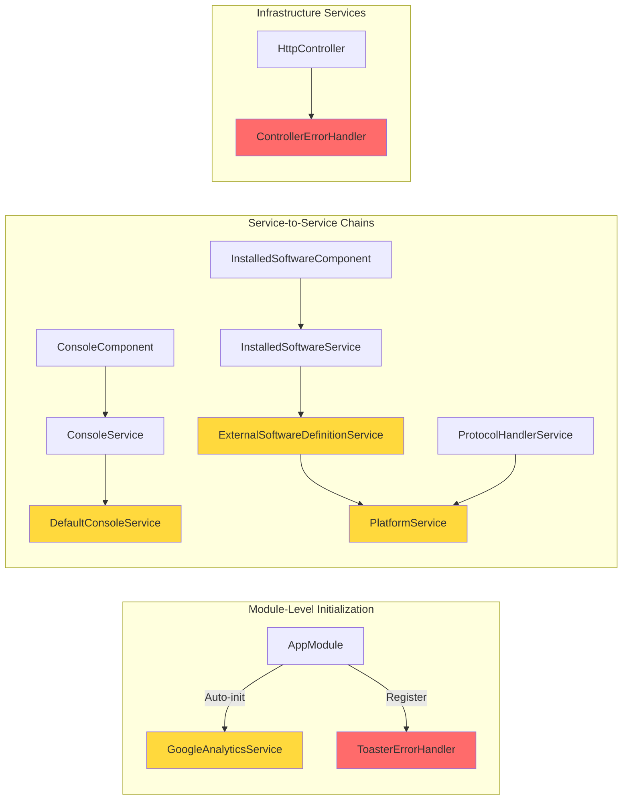
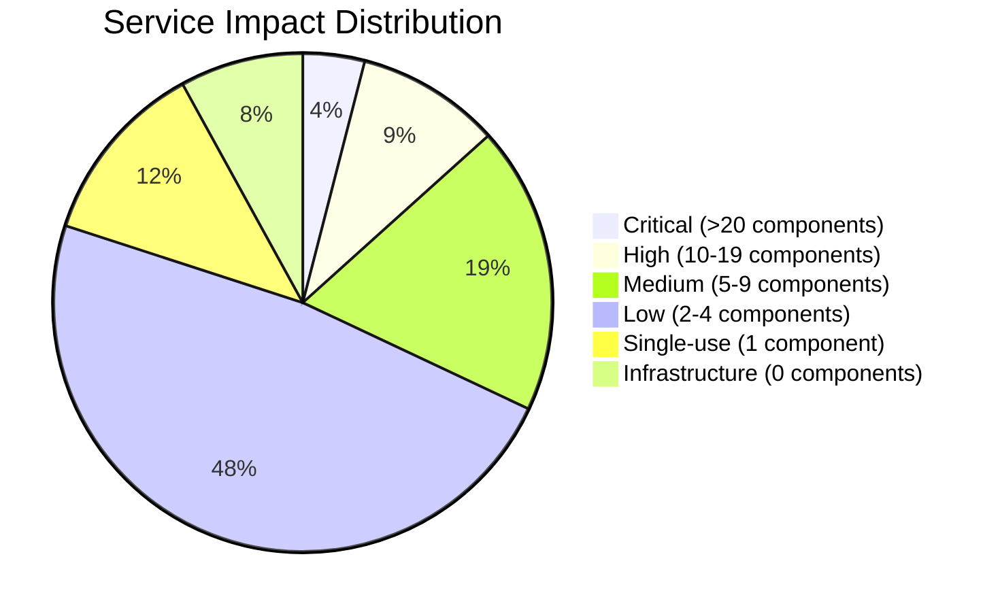

<!--
SPDX-License-Identifier: CC-BY-SA-4.0
See LICENSE file for licensing information.
-->

  > AI-assisted documentation. [See disclaimer](../README.md). 

# GNS3 Web UI - Service Dependency Analysis Report

**Analysis Date**: 2026-04-26
**Total Components Analyzed**: 249
**Total Services in Codebase**: 75
**Services Used by Components**: 69
**Services with Special Usage**: 6
**Total Service Dependencies**: 541
**Average Dependencies per Component**: 2.17

---

## 1. Service Usage Heatmap (Top 30)

| Rank | Service | Usage Count | Percentage |
|------|---------|-------------|------------|
| 1 | `ToasterService` | 121 | 22.4% |
| 2 | `ControllerService` | 62 | 11.5% |
| 3 | `NodeService` | 45 | 8.3% |
| 4 | `ThemeService` | 17 | 3.1% |
| 5 | `ProjectService` | 16 | 3.0% |
| 6 | `DialogConfigService` | 16 | 3.0% |
| 7 | `LinkService` | 15 | 2.8% |
| 8 | `DrawingService` | 15 | 2.8% |
| 9 | `ComputeService` | 13 | 2.4% |
| 10 | `ProgressService` | 12 | 2.2% |
| 11 | `NodeConsoleService` | 9 | 1.7% |
| 12 | `TemplateMocksService` | 9 | 1.7% |
| 13 | `BuiltInTemplatesService` | 9 | 1.7% |
| 14 | `MapSettingsService` | 8 | 1.5% |
| 15 | `UserService` | 8 | 1.5% |
| 16 | `QemuService` | 8 | 1.5% |
| 17 | `BuiltInTemplatesConfigurationService` | 7 | 1.3% |
| 18 | `SettingsService` | 6 | 1.1% |
| 19 | `TemplateService` | 6 | 1.1% |
| 20 | `UploadServiceService` | 6 | 1.1% |
| 21 | `DockerService` | 6 | 1.1% |
| 22 | `IouService` | 6 | 1.1% |
| 23 | `IosService` | 6 | 1.1% |
| 24 | `ToolsService` | 5 | 0.9% |
| 25 | `SymbolService` | 5 | 0.9% |
| 26 | `RoleService` | 5 | 0.9% |
| 27 | `GroupService` | 5 | 0.9% |
| 28 | `NotificationService` | 4 | 0.7% |
| 29 | `WindowBoundaryService` | 4 | 0.7% |
| 30 | `VncConsoleService` | 4 | 0.7% |

---

## 2. Service Dependency Architecture

### Overall Architecture

```mermaid
graph TB
    subgraph "Component Layer (249 components)"
        A[Components]
    end

    subgraph "Critical Services (High Impact)"
        B[ToasterService<br/>121 components]
        C[ControllerService<br/>62 components]
        D[NodeService<br/>45 components]
    end

    subgraph "High-Impact Services (10-19 components)"
        E[ThemeService<br/>17 components]
        F[ProjectService<br/>16 components]
        G[DialogConfigService<br/>16 components]
        H[LinkService<br/>15 components]
        I[DrawingService<br/>15 components]
        J[ComputeService<br/>13 components]
        K[ProgressService<br/>12 components]
    end

    subgraph "Infrastructure Services (Not used by components)"
        L[ControllerErrorHandler]
        M[ToasterErrorHandler]
        N[DefaultConsoleService]
        O[ExternalSoftwareDefinitionService]
        P[GoogleAnalyticsService]
        Q[PlatformService]
    end

    subgraph "Service-to-Service Dependencies"
        R[HttpController]
        S[ConsoleService]
        T[InstalledSoftwareService]
        U[ProtocolHandlerService]
    end

    A -->|48.6%| B
    A -->|24.9%| C
    A -->|18.1%| D
    A -->|6.8%| E
    A -->|6.4%| F
    A -->|6.4%| G
    A -->|6.0%| H
    A -->|6.0%| I
    A -->|5.2%| J
    A -->|4.8%| K

    R -->|Error Handling| L
    M -->|Display Errors| B
    S -->|Console Commands| N
    T -->|Software Definitions| O
    U -->|Platform Detection| Q
    A -.->|Unhandled Errors| M

    style B fill:#ff6b6b
    style C fill:#ff6b6b
    style D fill:#ff6b6b
    style L fill:#ffd93d
    style M fill:#ffd93d
```

### Special Usage Patterns Architecture

---

## 3. Key Insights

### Critical Findings

- **Most used service**: `ToasterService` (121 components) - Used in nearly half of all components
- **Total services in codebase**: 73 (69 used by components + 4 with special usage patterns)
- **Services used by components**: 69
- **Services with special usage**: 4 (module-level or service-to-service only)
- **Average dependencies per component**: 2.17
- **Services used by only 1 component**: 9
- **Services used by multiple components**: 60

### Top 10 Most Critical Services

| Rank | Service | Components | Percentage | Impact Level |
|------|---------|------------|------------|--------------|
| 1 | **ToasterService** | 121 | 48.6% | 🔴 Critical |
| 2 | **ControllerService** | 62 | 24.9% | 🔴 Critical |
| 3 | **NodeService** | 45 | 18.1% | 🔴 Critical |
| 4 | **ThemeService** | 17 | 6.8% | 🟡 High |
| 5 | **ProjectService** | 16 | 6.4% | 🟡 High |
| 6 | **DialogConfigService** | 16 | 6.4% | 🟡 High |
| 7 | **LinkService** | 15 | 6.0% | 🟡 High |
| 8 | **DrawingService** | 15 | 6.0% | 🟡 High |
| 9 | **ComputeService** | 13 | 5.2% | 🟡 High |
| 10 | **ProgressService** | 12 | 4.8% | 🟡 High |

### Service Impact Distribution

### Service Distribution Analysis

- **High-impact services** (used by >20 components): 3 services
  - ToasterService: 121 components
  - ControllerService: 62 components
  - NodeService: 45 components

- **Medium-impact services** (used by 10-19 components): 7 services
  - ThemeService, ProjectService, DialogConfigService, LinkService, DrawingService, ComputeService, ProgressService

- **Low-impact services** (used by 5-9 components): 14 services

- **Minimal-impact services** (used by 2-4 components): 36 services

- **Single-use services** (used by 1 component): 9 services

### Least Used Services (Single Usage)

These services are only used by one component each:

1. **VersionService** - `login.component`
2. **PrivilegeService** - `role-detail.component`
3. **BackgroundUploadService** - `add-image-dialog.component`
4. **ProgressDialogService** - `snapshot-dialog.component`
5. **ConsoleService** - `console.component`
6. **InfoService** - `info-dialog.component`
7. **ApplianceService** - `new-template-dialog.component`
8. **DeviceDetectorService** - `console-device-action-browser.component`
9. **ControllerSettingsService** - `qemu-preferences.component`

### Services Not Used by Components (6 services)

These services exist in the codebase but are **not directly used by any component**. They serve special purposes:

| Service | File | Usage Pattern | Impact |
|---------|------|---------------|--------|
| **DefaultConsoleService** | `settings/default-console.service.ts` | Service-to-service dependency: Used only by `ConsoleService` | 🟡 Medium - Part of console settings chain |
| **ExternalSoftwareDefinitionService** | `external-software-definition.service.ts` | Service-to-service dependency: Used only by `InstalledSoftwareService` | 🟢 Low - Software detection definitions |
| **GoogleAnalyticsService** | `google-analytics.service.ts` | Module-level initialization: Auto-initialized in `app.module.ts` for route tracking | 🟢 Low - Analytics only |
| **PlatformService** | `platform.service.ts` | Service-to-service dependency: Used by `ExternalSoftwareDefinitionService` and `ProtocolHandlerService` | 🟡 Medium - Platform detection utility |
| **ControllerErrorHandler** | `http-controller.service.ts` | Service-to-service dependency: Used only by `HttpController` for centralized HTTP error handling | 🔴 Critical - Core error handling infrastructure |
| **ToasterErrorHandler** | `common/error-handlers/toaster-error-handler.ts` | Global error handler: Registered as Angular's global `ErrorHandler` in `app.module.ts` | 🔴 Critical - Global error handling |

#### Detailed Usage Patterns

**1. DefaultConsoleService**
- **Pattern**: Service-to-service dependency chain
- **Flow**: Component → ConsoleService → DefaultConsoleService
- **Purpose**: Provides default console command detection
- **Impact**: Indirect - used by ConsoleService which is used by ConsoleComponent

**2. ExternalSoftwareDefinitionService**
- **Pattern**: Two-level service-to-service dependency
- **Flow**: Component → InstalledSoftwareService → ExternalSoftwareDefinitionService
- **Purpose**: Defines external software detection rules
- **Impact**: Indirect - software detection definitions

**3. GoogleAnalyticsService**
- **Pattern**: Module-level initialization
- **Flow**: AppModule constructor → GoogleAnalyticsService initialization
- **Purpose**: Auto-initializes on app bootstrap, subscribes to Router events
- **Impact**: Analytics only, no component dependencies

**4. PlatformService**
- **Pattern**: Multi-service utility dependency
- **Flow**: Used by ExternalSoftwareDefinitionService and ProtocolHandlerService
- **Purpose**: Platform detection (Windows/Linux/Mac)
- **Impact**: Medium - platform detection utility for multiple services

**5. ControllerErrorHandler**
- **Pattern**: Infrastructure service dependency
- **Flow**: HttpController → ControllerErrorHandler
- **Purpose**: Centralized HTTP error handling for all API calls
- **Impact**: Critical - wraps all HttpController methods with error transformation

**6. ToasterErrorHandler**
- **Pattern**: Global error handler registration
- **Flow**: AppModule providers → Angular ErrorHandler → ToasterErrorHandler
- **Purpose**: Catches all unhandled errors and displays via ToasterService
- **Impact**: Critical - global error handling safety net

#### Why These Services Weren't Counted

The analysis methodology only counts **component → service** direct dependencies (via `inject()` function calls). These services use different patterns:

- ❌ **Service-to-service dependencies** (not counted)
- ❌ **Module-level service initialization** (not counted)
- ❌ **Indirect dependency chains** (not counted)

**Impact Assessment**: These services have **low to medium impact** on the application:
- They are used by other services (which ARE used by components)
- Changes to these services may indirectly affect components
- `PlatformService` has the highest indirect impact (used by 2 services that are used by components)

---

## 3. Detailed Service Reference List

### ToasterService (121 components)

**Purpose**: User notification and toast messages

**Referenced by**:
- acl-management, add-ace-dialog, add-blank-project-dialog, add-controller-dialog
- add-docker-template, add-group-dialog, add-image-dialog, add-ios-template
- add-iou-template, add-qemu-vm-template, add-resource-pool-dialog
- add-user-dialog, add-user-to-group-dialog, add-virtual-box-template
- add-vmware-template, add-vpcs-template, auto-idle-pc-action
- change-hostname-dialog, change-user-password, cloud-nodes-add-template
- cloud-nodes-template-details, computes, config-editor
- configurator-atm-switch, configurator-cloud, configurator-docker
- configurator-ethernet-hub, configurator-ethernet-switch, configurator-ios
- configurator-iou, configurator-nat, configurator-qemu, configurator-switch
- configurator-virtualbox, configurator-vmware, configurator-vpcs
- configure-custom-adapters, confirmation-delete-all-projects
- console-device-action-browser, console-device-action, console
- context-console-menu, copy-docker-template, copy-ios-template
- copy-iou-template, copy-qemu-vm-template, create-snapshot-dialog
- custom-adapters, default-layout, delete-action, delete-template
- deleteallfiles-dialog, direct-link, docker-template-details
- duplicate-action, edit-controller-dialog, edit-network-configuration
- edit-project-dialog, ethernet-hubs-add-template
- ethernet-hubs-template-details, ethernet-switches-add-template
- ethernet-switches-template-details, export-config-action
- group-detail-dialog, group-management, http-console-action
- http-console-new-tab-action, idle-pc-dialog, image-manager
- import-appliance, import-config-action, import-project-dialog
- ios-template-details, iou-template-details, isolate-node-action
- link-style-editor, logged-user, login, move-layer-down-action
- move-layer-up-action, new-template-dialog, nodes-menu, ports
- project-map-menu, project-map, projects, qemu-image-creator
- qemu-preferences, qemu-vm-template-details, reload-node-action
- reset-link-action, resource-pool-details, resource-pools-management
- resume-link-action, role-detail, role-management, save-project-dialog
- screenshot-dialog, settings, snapshot-dialog, start-capture
- start-node-action, start-web-wireshark-action, status-info
- stop-capture-action, stop-node-action, style-editor, suspend-link-action
- suspend-node-action, template-list-dialog, template-name-dialog
- template, text-editor, unisolate-node-action, user-detail-dialog
- user-management, virtual-box-template-details, vmware-template-details
- vpcs-template-details, web-console-inline, web-wireshark-inline

### ControllerService (62 components)

**Purpose**: GNS3 controller management and communication

**Referenced by**:
- acl-management, add-controller-dialog, add-docker-template
- add-ios-template, add-iou-template, add-qemu-vm-template
- add-virtual-box-template, add-vmware-template, add-vpcs-template
- ai-chat, app, bundled-controller-finder, cloud-nodes-add-template
- cloud-nodes-template-details, cloud-nodes-templates, computes
- console-device-action, controllers, copy-docker-template
- copy-ios-template, copy-iou-template, copy-qemu-vm-template
- default-layout, direct-link, docker-template-details, docker-templates
- dynamips-preferences, edit-controller-dialog
- ethernet-hubs-add-template, ethernet-hubs-template-details
- ethernet-hubs-templates, ethernet-switches-add-template
- ethernet-switches-template-details, ethernet-switches-templates
- group-management, image-manager, ios-template-details
- ios-templates, iou-template-details, iou-templates
- logged-user, login, management, nodes-menu, project-map
- qemu-preferences, qemu-vm-template-details, qemu-vm-templates
- resource-pools-management, role-management, status-info
- user-management, virtual-box-preferences, virtual-box-template-details
- virtual-box-templates, vmware-preferences, vmware-template-details
- vmware-templates, vpcs-preferences, vpcs-template-details
- vpcs-templates, web-console-full-window

### NodeService (45 components)

**Purpose**: Node management and operations

**Referenced by**:
- align-horizontally, align-vertically, auto-idle-pc-action
- bring-to-front-action, change-symbol-dialog, configurator-atm-switch
- configurator-cloud, configurator-docker, configurator-ethernet-hub
- configurator-ethernet-switch, configurator-ios, configurator-iou
- configurator-nat, configurator-qemu, configurator-switch
- configurator-virtualbox, configurator-vmware, configurator-vpcs
- configure-custom-adapters, console-device-action-browser
- console-device-action, delete-action, duplicate-action
- edit-network-configuration, export-config-action, idle-pc-action
- idle-pc-dialog, import-config-action, isolate-node-action
- lock-action, log-console, move-layer-down-action
- move-layer-up-action, node-dragged, node-label-dragged
- nodes-menu, project-map-menu, project-map, reload-node-action
- start-node-action, stop-node-action, suspend-node-action
- text-editor, unisolate-node-action, web-console-full-window

### ThemeService (17 components)

**Purpose**: Theme management and UI styling

**Referenced by**:
- adbutler, app, chat-input-area, confirmation-bottomsheet
- console-wrapper, controllers, log-console, login
- navigation-dialog, project-map-menu, project-map, projects
- settings, template, topology-summary, web-console-full-window
- web-console

### ProjectService (16 components)

**Purpose**: Project management and operations

**Referenced by**:
- add-blank-project-dialog, choose-name-dialog
- confirmation-delete-all-projects, default-layout
- edit-project-dialog, export-portable-project, import-project-dialog
- link-created, lock-action, project-map-menu, project-map
- project-readme, projects, readme-editor, save-project-dialog
- topology-summary

### DialogConfigService (16 components)

**Purpose**: Dialog configuration management

**Referenced by**:
- change-symbol-action, cloud-nodes-template-details
- docker-template-details, edit-link-style-action
- ethernet-hubs-template-details, ethernet-switches-template-details
- ios-template-details, iou-template-details, packet-filters-action
- packet-filters, qemu-vm-template-details, start-capture-action
- symbols, virtual-box-template-details, vmware-template-details
- vpcs-template-details

### LinkService (15 components)

**Purpose**: Link management between nodes

**Referenced by**:
- delete-action, interface-label-dragged, link-created
- link-editing, link-style-editor, packet-filters, project-map
- reset-link-action, resume-link-action, start-capture
- stop-capture-action, suspend-link-action, text-editor
- web-wireshark-inline

### DrawingService (15 components)

**Purpose**: Drawing and shape management on the map

**Referenced by**:
- bring-to-front-action, curve-drawing, delete-action
- drawing-added, drawing-dragged, drawing-resized
- duplicate-action, lock-action, move-layer-down-action
- move-layer-up-action, project-map-menu, style-editor
- text-added, text-edited, text-editor

### ComputeService (13 components)

**Purpose**: Compute node management

**Referenced by**:
- add-docker-template, add-ios-template, add-iou-template
- add-qemu-vm-template, add-vpcs-template, cloud-nodes-add-template
- computes, ethernet-hubs-add-template, new-template-dialog
- status-info, template-list-dialog, template, topology-summary

### ProgressService (12 components)

**Purpose**: Progress indication for long-running operations

**Referenced by**:
- add-ios-template, app, auto-idle-pc-action
- bundled-controller-finder, default-layout, ios-template-details
- new-template-dialog, progress, project-map, projects
- role-management, user-management

---

## 4. Architecture Recommendations

### 1. Critical Infrastructure

The following services are critical to the application and should receive the highest level of testing and maintenance:

- **ToasterService**: Used by 48.6% of all components - any changes have widespread impact
- **ControllerService**: Core communication layer - 24.9% dependency rate
- **NodeService**: Central to node operations - 18.1% dependency rate

### 2. Refactoring Opportunities

**Single-use components services** (used by only 1 component):
- VersionService, PrivilegeService, BackgroundUploadService, ProgressDialogService
- ConsoleService, InfoService, ApplianceService, DeviceDetectorService
- ControllerSettingsService

**Special usage pattern services** (not used by any component):
- DefaultConsoleService, ExternalSoftwareDefinitionService, GoogleAnalyticsService, PlatformService

These services could potentially be:
- Merged into related services to reduce complexity
- Restructured to follow standard component-to-service patterns
- Documented as utility services for service-to-service communication

### 3. Service Categorization

**Core Services** (high usage, >10 components):
- ToasterService, ControllerService, NodeService, ThemeService, ProjectService
- DialogConfigService, LinkService, DrawingService, ComputeService, ProgressService

**Domain Services** (medium usage, 5-9 components):
- NodeConsoleService, TemplateMocksService, BuiltInTemplatesService
- MapSettingsService, UserService, QemuService
- ToolsService, SymbolService, RoleService, GroupService

**Specialized Services** (low usage, 1-4 components):
- Platform-specific services (QemuService, DockerService, VirtualBoxService, etc.)
- Configuration services (various *ConfigurationService classes)
- Utility services (ToolsService, SymbolService, WindowBoundaryService)

**Special Usage Pattern Services** (not used by components):
- DefaultConsoleService (service-to-service dependency)
- ExternalSoftwareDefinitionService (service-to-service dependency)
- GoogleAnalyticsService (module-level initialization)
- PlatformService (service-to-service dependency)

### 4. Dependency Distribution

The average component has 2.17 service dependencies, which indicates:
- Good separation of concerns
- Moderate coupling between components and services
- No excessive service bloat in individual components

---

## 5. Methodology

**Analysis Scope**:
- Analyzed 249 `.component.ts` files in `/home/yueguobin/myCode/GNS3/gns3-web-ui/src/app`
- Extracted service dependencies using `inject()` function calls and constructor parameters
- Identified services by matching patterns: `*Service` class names

**Limitations**:
- Only analyzes **component-to-service dependencies** (direct `inject()` calls)
- Does not include **service-to-service dependencies** (e.g., `DefaultConsoleService` → `ConsoleService`)
- Does not track **module-level service initialization** (e.g., `GoogleAnalyticsService`, `ToasterErrorHandler` in `app.module.ts`)
- Does not track usage frequency, only injection count
- **Total services**: 75 (69 analyzed + 6 with special usage patterns)

**Special Usage Patterns Not Captured**:
1. **Service-to-service chains**: Service A depends on Service B, which depends on Service C
2. **Module-level initialization**: Services auto-initialized in module constructors (e.g., global error handlers)
3. **Indirect dependencies**: Services used by other services but not directly by components
4. **Infrastructure services**: Critical services used by other services but not components (e.g., error handlers)

**Tools Used**:
- Python 3 script with regex pattern matching
- pathlib for file system traversal
- collections for data aggregation

---

*Report generated on 2026-04-22*

<!--
SPDX-License-Identifier: CC-BY-SA-4.0
-->