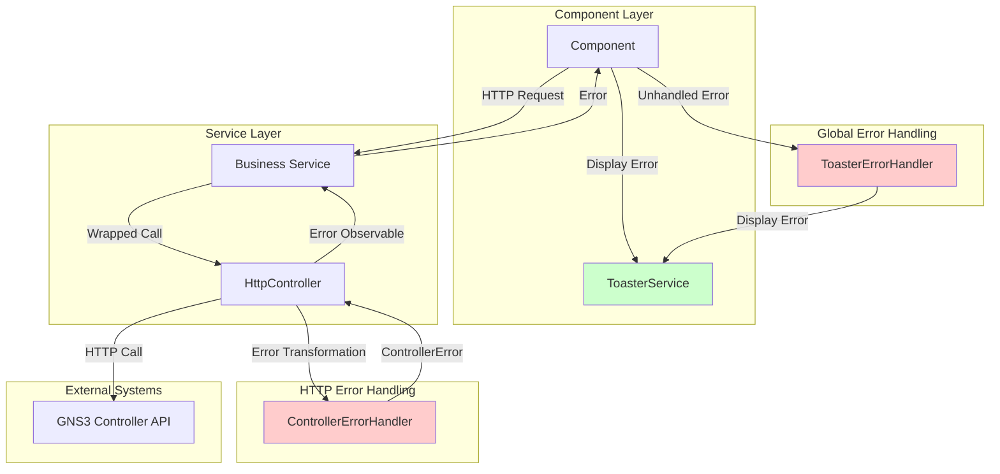
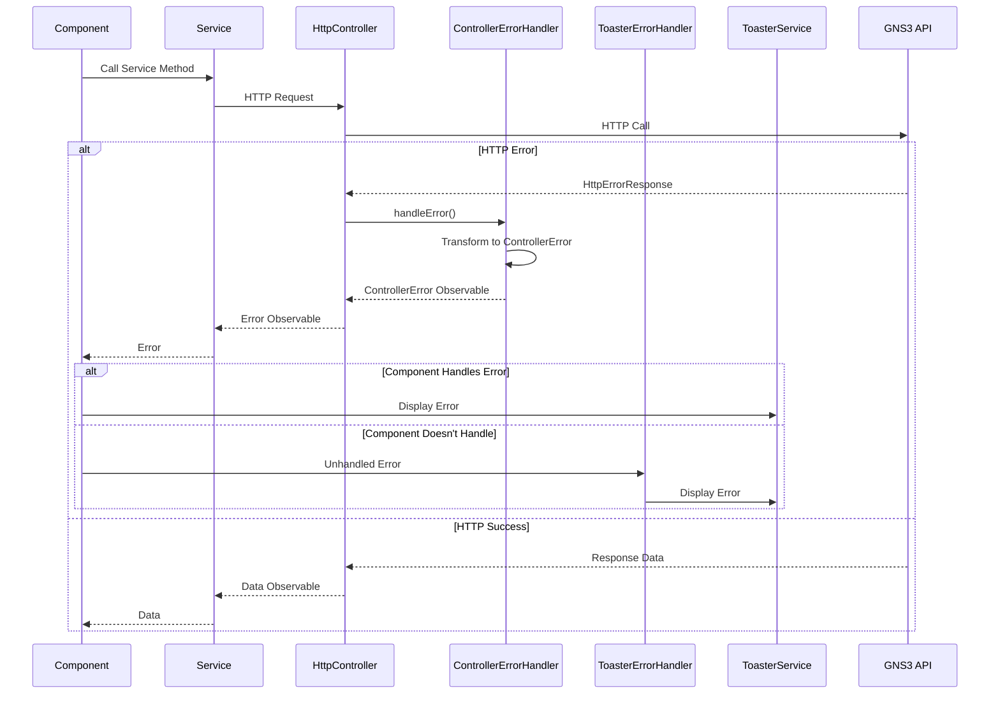
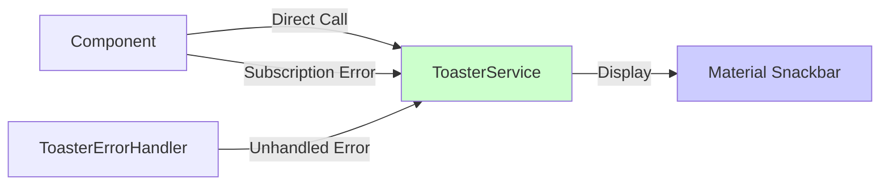

<!--
SPDX-License-Identifier: CC-BY-SA-4.0
See LICENSE file for licensing information.
-->

  > AI-assisted documentation. [See disclaimer](../README.md). 

# GNS3 Web UI - Service Inventory by Domain

> Complete catalog of all services categorized by functional domain

**Last Updated**: 2026-04-26
**Total Services**: 75

---

## Summary

| Domain | Services | Description |
|--------|----------|-------------|
| Project Management | 9 | Project, template, snapshot, appliance management |
| Node Management | 4 | Node, link, drawing, symbol operations |
| Controller/Compute | 6 | Controller and compute node management |
| Console | 6 | Terminal and console services |
| User/Permission | 6 | User, group, role, ACL, authentication |
| Virtualization | 12 | Docker, QEMU, VirtualBox, VMware, IOS, IOU |
| Network Simulation | 3 | VPCS, packet capture |
| AI Features | 2 | AI chat and profile management |
| System/Utilities | 21 | Settings, theme, notifications, progress, error handling |
| Other/Utilities | 6 | Platform, version, external software |

---

## 1. Project Management (9 services)

Services for project lifecycle, templates, snapshots, and appliances.

| Service | File | Description | Dependencies |
|---------|------|-------------|--------------|
| **ProjectService** | `project.service.ts` | Project CRUD, export/import, statistics, compression | HttpController, SettingsService, RecentlyOpenedProjectService |
| **TemplateService** | `template.service.ts` | Template listing and deletion | HttpController |
| **SnapshotService** | `snapshot.service.ts` | Snapshot creation, deletion, listing, restoration | HttpController |
| **ApplianceService** | `appliances.service.ts` | Appliance management and installation | HttpController |
| **BuiltInTemplatesService** | `built-in-templates.service.ts` | Built-in template CRUD operations | HttpController |
| **BuiltInTemplatesConfigurationService** | `built-in-templates-configuration.service.ts` | Configuration data for built-in templates | None |
| **RecentlyOpenedProjectService** | `recentlyOpenedProject.service.ts` | Tracks recently opened projects | None |
| **ResourcePoolsService** | `resource-pools.service.ts` | Resource pool management for projects | HttpController, ProjectService |
| **TemplateMocksService** | `template-mocks.service.ts` | Mock templates for testing | None |

---

## 2. Node Management (4 services)

Services for managing nodes, links, drawings, and symbols on the project map.

| Service | File | Description | Dependencies |
|---------|------|-------------|--------------|
| **NodeService** | `node.service.ts` | Node CRUD, start/stop, position, label, symbol, configuration | HttpController |
| **LinkService** | `link.service.ts` | Link creation, deletion, updates, capture, filters | HttpController |
| **DrawingService** | `drawing.service.ts` | Drawing/object management on project map | HttpController, SvgToDrawingConverter |
| **SymbolService** | `symbol.service.ts` | Symbol management, dimensions, blob URLs, custom/builtin | HttpController |

---

## 3. Controller/Compute (6 services)

Services for controller and compute node management.

| Service | File | Description | Dependencies |
|---------|------|-------------|--------------|
| **ControllerService** | `controller.service.ts` | Controller CRUD, localStorage, version checking | HttpController |
| **ControllerSettingsService** | `controller-settings.service.ts` | Controller settings, QEMU settings | HttpController |
| **ControllerManagementService** | `controller-management.service.ts` | Local controller lifecycle (web stub) | None |
| **ComputeService** | `compute.service.ts` | Compute node CRUD, connections, statistics | HttpController |
| **ConnectionManagerService** | `connection-manager.service.ts` | WebSocket connection lifecycle for notifications | NotificationService |
| **HttpController** | `http-controller.service.ts` | HTTP client wrapper with auth, centralized error handling, URL construction | HttpClient, ControllerErrorHandler |

---

## 4. Console (6 services)

Services for terminal and console management.

| Service | File | Description | Dependencies |
|---------|------|-------------|--------------|
| **NodeConsoleService** | `nodeConsole.service.ts` | Console opening, URL building, batch operations | Router, ToasterService, MapSettingsService |
| **VncConsoleService** | `vnc-console.service.ts` | VNC console via standalone HTML page | ToasterService |
| **XpraConsoleService** | `xpra-console.service.ts` | Xpra console via standalone HTML page | ToasterService |
| **XtermService** | `xterm.service.ts` | xterm.js terminal theme, initialization, dimensions | ThemeService |
| **XtermContextMenuService** | `xterm-context-menu.service.ts` | xterm.js context menu (copy/paste/select all) | ToasterService |
| **ConsoleService** | `settings/console.service.ts` | Console command settings | DefaultConsoleService, SettingsService |

---

## 5. User/Permission/Access Control (6 services)

Services for user authentication, authorization, and access control.

| Service | File | Description | Dependencies |
|---------|------|-------------|--------------|
| **UserService** | `user.service.ts` | User CRUD, group membership | HttpController |
| **GroupService** | `group.service.ts` | Group CRUD, membership, role assignment | HttpController |
| **RoleService** | `role.service.ts` | Role CRUD, privilege assignment | HttpController |
| **PrivilegeService** | `privilege.service.ts` | Privilege listing | HttpController |
| **AclService** | `acl.service.ts` | Access Control List management | HttpController |
| **LoginService** | `login.service.ts` | User authentication, token management | HttpController |

---

## 6. Virtualization (12 services)

Services for managing virtualization platforms (Docker, QEMU, VirtualBox, VMware, IOS, IOU).

### Docker
| Service | File | Description | Dependencies |
|---------|------|-------------|--------------|
| **DockerService** | `docker.service.ts` | Docker template and image management | HttpController |
| **DockerConfigurationService** | `docker-configuration.service.ts` | Docker configuration data | None |

### QEMU
| Service | File | Description | Dependencies |
|---------|------|-------------|--------------|
| **QemuService** | `qemu.service.ts` | QEMU template and image management, disk creation | HttpController |
| **QemuConfigurationService** | `qemu-configuration.service.ts` | QEMU configuration data | None |

### VirtualBox
| Service | File | Description | Dependencies |
|---------|------|-------------|--------------|
| **VirtualBoxService** | `virtual-box.service.ts` | VirtualBox template and VM management | HttpController |
| **VirtualBoxConfigurationService** | `virtual-box-configuration.service.ts` | VirtualBox configuration data | None |

### VMware
| Service | File | Description | Dependencies |
|---------|------|-------------|--------------|
| **VmwareService** | `vmware.service.ts` | VMware template and VM management | HttpController |
| **VmwareConfigurationService** | `vmware-configuration.service.ts` | VMware configuration data | None |

### IOS
| Service | File | Description | Dependencies |
|---------|------|-------------|--------------|
| **IosService** | `ios.service.ts` | IOS image and template management, IdlePC | HttpController |
| **IosConfigurationService** | `ios-configuration.service.ts` | IOS configuration data | None |

### IOU
| Service | File | Description | Dependencies |
|---------|------|-------------|--------------|
| **IouService** | `iou.service.ts` | IOU image and template management | HttpController |
| **IouConfigurationService** | `iou-configuration.service.ts` | IOU configuration data | None |

---

## 7. Network Simulation (3 services)

Services for network simulation and packet capture.

| Service | File | Description | Dependencies |
|---------|------|-------------|--------------|
| **VpcsService** | `vpcs.service.ts` | VPCS template management | HttpController |
| **VpcsConfigurationService** | `vpcs-configuration.service.ts` | VPCS configuration data | None |
| **PacketCaptureService** | `packet-capture.service.ts` | Packet capture via protocol handler | ProtocolHandlerService |

---

## 8. AI Features (2 services)

Services for AI-powered features (GNS3 Copilot).

| Service | File | Description | Dependencies |
|---------|------|-------------|--------------|
| **AiChatService** | `ai-chat.service.ts` | GNS3 Copilot chat, streaming, session management | HttpClient, HttpController, ControllerService |
| **AiProfilesService** | `ai-profiles.service.ts` | LLM model configuration (user/group) | HttpController |

---

## 9. System/Utilities (21 services)

Core system services for settings, UI, notifications, error handling, and utilities.

| Service | File | Description | Dependencies |
|---------|------|-------------|--------------|
| **SettingsService** | `settings.service.ts` | Application settings (crash reports, stats, console) | None |
| **ThemeService** | `theme.service.ts` | Material Design 3 theme, light/dark mode | None |
| **ToasterService** | `toaster.service.ts` | Toast notifications (success/warning/error) - **Used by 121 components (48.6%)** | MatSnackBar |
| **NotificationService** | `notification.service.ts` | WebSocket notifications for compute events | None |
| **ProgressService** | `progress.service.ts` | Progress dialog state | None |
| **ProgressDialogService** | `progress-dialog.service.ts` | Progress dialog display | MatDialog |
| **UploadServiceService** | `upload-service.service.ts` | Upload progress bar state | None |
| **BackgroundUploadService** | `background-upload.service.ts` | Background image upload queue | HttpClient, ImageManagerService, ImageUploadSessionService, ToasterService |
| **ImageManagerService** | `image-manager.service.ts` | Image listing, upload, deletion, pruning | HttpController |
| **ImageUploadSessionService** | `image-upload-session.service.ts` | Image upload session state and events | None |
| **DialogConfigService** | `dialog-config.service.ts` | Centralized dialog configuration | None |
| **MapSettingsService** | `mapsettings.service.ts` | Map display settings (layers, labels, locking) | None |
| **MapScaleService** | `mapScale.service.ts` | Map scaling management | Context |
| **ToolsService** | `tools.service.ts` | Toolbar tool activation state | None |
| **WindowManagementService** | `window-management.service.ts` | Window minimize/restore state | None |
| **WindowBoundaryService** | `window-boundary.service.ts` | Window boundary constraints | None |
| **PlatformService** | `platform.service.ts` | Platform detection (Windows/Linux/Mac) | None |
| **ProtocolHandlerService** | `protocol-handler.service.ts` | Custom protocol handler invocation | ToasterService, DeviceDetectorService, LoginService |
| **VersionService** | `version.service.ts` | Controller version information | HttpController |
| **UpdatesService** | `updates.service.ts` | GNS3 version update checks | HttpClient |
| **ControllerErrorHandler** | `http-controller.service.ts` | HTTP error handling and transformation | None |
| **ToasterErrorHandler** | `common/error-handlers/toaster-error-handler.ts` | Global error handler with toast notifications | ToasterService |

---

## 10. Other/Utilities (6 services)

Miscellaneous utility services.

| Service | File | Description | Dependencies |
|---------|------|-------------|--------------|
| **InfoService** | `info.service.ts` | Node and port information display | None |
| **GoogleAnalyticsService** | `google-analytics.service.ts` | Google Analytics integration | Router, SettingsService |
| **DefaultConsoleService** | `default-console.service.ts` | Default console command detection | None |
| **ExternalSoftwareDefinitionService** | `external-software-definition.service.ts` | External software definitions | PlatformService |
| **InstalledSoftwareService** | `installed-software.service.ts` | Installed software detection | ExternalSoftwareDefinitionService |
| **TemplateMocksService** | `template-mocks.service.ts` | Mock template data for testing | None |

---

## Key Findings

### Architecture Patterns

1. **Configuration Services**: Each virtualization platform has a main service + configuration service pair
2. **HTTP Communication**: Most services depend on `HttpController` for API calls
3. **Settings Management**: `SettingsService` and `ThemeService` provide persistent configuration
4. **Notification System**: `NotificationService` and `ConnectionManagerService` manage WebSocket connections
5. **Progress Tracking**: Multiple services track progress/state

### Dependencies

#### Service-to-Service Dependencies

- **HttpController**: Used by 40+ services for HTTP communication
- **ToasterService**: Used by 10+ services for user notifications
- **ThemeService**: Used by console and UI services for theming
- **SettingsService**: Used by settings and configuration services

#### Component-to-Service Dependencies (Usage Heatmap)

**Analysis Summary** (based on 249 components):
- **Total unique services used by components**: 69
- **Total service dependencies**: 541
- **Average dependencies per component**: 2.17

**Top 10 Most Used Services by Components**:

| Rank | Service | Components | Impact Level |
|------|---------|------------|--------------|
| 1 | **ToasterService** | 121 (48.6%) | 🔴 Critical - nearly half of all components |
| 2 | **ControllerService** | 62 (24.9%) | 🔴 Critical - core communication layer |
| 3 | **NodeService** | 45 (18.1%) | 🔴 Critical - central to node operations |
| 4 | **ThemeService** | 17 (6.8%) | 🟡 High - UI theming |
| 5 | **ProjectService** | 16 (6.4%) | 🟡 High - project management |
| 6 | **DialogConfigService** | 16 (6.4%) | 🟡 High - dialog configuration |
| 7 | **LinkService** | 15 (6.0%) | 🟡 High - link management |
| 8 | **DrawingService** | 15 (6.0%) | 🟡 High - drawing operations |
| 9 | **ComputeService** | 13 (5.2%) | 🟡 High - compute node management |
| 10 | **ProgressService** | 12 (4.8%) | 🟡 High - progress tracking |

**Impact Assessment**:
- 🔴 **Critical services** (>20 components): 3 services - Changes require extensive testing
- 🟡 **High-impact services** (10-19 components): 7 services - Changes affect multiple features
- 🟢 **Medium-impact services** (5-9 components): 14 services - Moderate testing needed
- 🔵 **Low-impact services** (2-4 components): 36 services - Minimal testing needed
- ⚪ **Single-use services** (1 component): 9 services - May need refactoring

> 📊 **Full analysis report**: See [`service-dependency-analysis-report.md`](./service-dependency-analysis-report.md) for complete statistics including all 69 services and their component references.

### Framework Compatibility

- **Zoneless Framework**: All services are compatible with Angular's zoneless mode
- **Signal-based State**: Modern services use Signals for state management
- **Centralized Configuration**: Dialog and settings configurations are centralized
- **Modular Design**: Virtualization platforms follow consistent patterns

---

## Error Handling Architecture

GNS3 Web UI implements a **two-tier error handling system** for robust error management.

### Architecture Diagram

### Tier 1: HTTP Layer Error Handling

**ControllerErrorHandler** provides centralized HTTP error handling:

| Responsibility | Description |
|----------------|-------------|
| Error Transformation | Converts `HttpErrorResponse` to `ControllerError` |
| Unreachable Controller Detection | Handles status 0 (network failures) |
| Message Extraction | Extracts server error messages from response bodies |
| Automatic Wrapping | Applied to all `HttpController` methods |

**Error Types Handled**:

| Error Type | Source | Transformation |
|------------|--------|----------------|
| Status 0 | Network failure | "Controller is unreachable" |
| Server Error | API response | Extract `error.message` |
| HTTP Error | Angular HTTP | Wrap in `ControllerError` |

### Tier 2: Global Application Error Handler

**ToasterErrorHandler** implements Angular's global error handling:

| Responsibility | Description |
|----------------|-------------|
| Global Error Capture | Catches all unhandled errors via Angular's `ErrorHandler` |
| Error Message Extraction | Extracts messages from various error types |
| User Notification | Displays errors via `ToasterService` |
| Console Logging | Logs errors (excludes 400, 403, 404, 409) |

**Error Message Extraction Priority**:

1. `error.error.message` - Server response body message
2. `error.message` - Error object message
3. `error.error` - Raw error object
4. Fallback to "Handled unknown error"

### Error Handling Flow

### Error Handling by Layer

| Layer | Responsibility | Error Handler |
|-------|----------------|---------------|
| **HTTP Layer** | API call errors | `ControllerErrorHandler` |
| **Service Layer** | Business logic errors | None (propagates to component) |
| **Component Layer** | User-facing errors | `ToasterService` |
| **Global Layer** | Unhandled errors | `ToasterErrorHandler` |

---

## ToasterService Architecture

**Most Critical Service** - Used by 121 components (48.6% of all components)

### Notification Types

| Type | Duration | Panel Class | Use Case |
|------|----------|-------------|----------|
| Success | 4 seconds | `snackabar-success` | Operation completed successfully |
| Warning | 4 seconds | `snackabar-warning` | Non-critical issues |
| Error | 10 seconds | `snackabar-error` | Operation failures |

### Notification Configuration

| Property | Value |
|----------|-------|
| Horizontal Position | Center |
| Vertical Position | Bottom |
| Action Button | Close |
| Auto-dismiss | Yes |
| Styling | Material Design 3 themed |

### ToasterService Integration Flow

### Usage Patterns

| Pattern | Description | Components |
|---------|-------------|------------|
| **Direct Success** | Show success message after operation | 121 components |
| **Direct Warning** | Show warning for non-critical issues | 121 components |
| **Direct Error** | Show error message after failure | 121 components |
| **Subscription Error** | Handle observable errors | Most components |
| **Global Handler** | Automatic via `ToasterErrorHandler` | All components |

---

---

<!--
SPDX-License-Identifier: CC-BY-SA-4.0
-->
